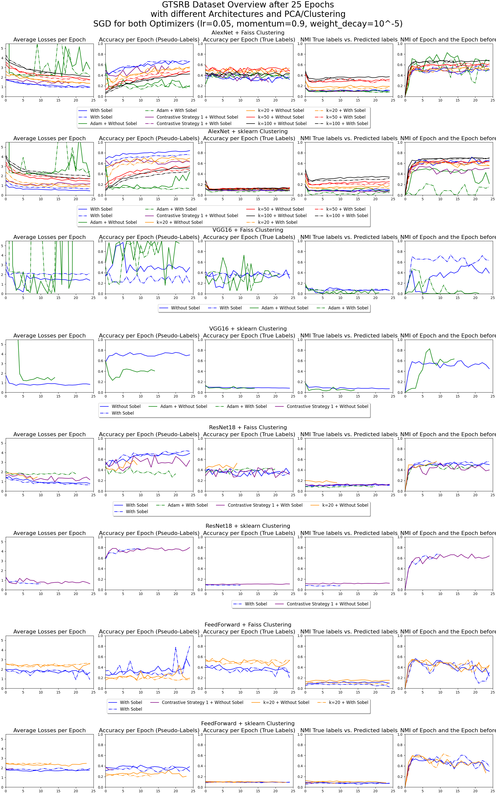

### GTSRB
- Tested with faiss and scikit-learn library for both PCA and k-Means clustering with each possible combination
- Plots:
    1. Average loss for each epoch
    2. Training accuracy for pseudo-labels and output
    3. True accuracy for true labels and output
    4. NMI tested on the true labels and the pseudo-labels
    5. NMI tested on the clustering results of the current and previous epoch (at first epoch always 0.0)
    6. Time take for each segment and total (blue) -> TODO: Coloring
- Colors:
  - blue: Sobel filtering is **not** active
  - green: Sobel filtering is active





#### AlexNet
**Without Sobel**:
```bash
python3 main.py --arch AlexNet --input_dim 3 --num_classes 10 --epochs 25 --requires_grad --dataset GTSRB --ds_train --batch_size 128 --reassign_optimizer_tl --pca --pca_method faiss --pca_whitening --clustering faiss --metrics --metrics_dir ./metrics/GTSRB/5_runs_100_epochs/ -v --remove_head; python3 main.py --arch AlexNet --input_dim 3 --num_classes 10 --epochs 25 --requires_grad --dataset GTSRB --ds_train --batch_size 128 --reassign_optimizer_tl --pca --pca_method sklearn --pca_whitening --clustering faiss --metrics --metrics_dir ./metrics/GTSRB/5_runs_100_epochs/ -v --remove_head; python3 main.py --arch AlexNet --input_dim 3 --num_classes 10 --epochs 25 --requires_grad --dataset GTSRB --ds_train --batch_size 128 --reassign_optimizer_tl --pca --pca_method faiss --pca_whitening --clustering sklearn --metrics --metrics_dir ./metrics/GTSRB/5_runs_100_epochs/ -v --remove_head; python3 main.py --arch AlexNet --input_dim 3 --num_classes 10 --epochs 25 --requires_grad --dataset GTSRB --ds_train --batch_size 128 --reassign_optimizer_tl --pca --pca_method sklearn --pca_whitening --clustering sklearn --metrics --metrics_dir ./metrics/GTSRB/5_runs_100_epochs/ -v --remove_head;
```

**With Sobel**:
```bash
python3 main.py --arch AlexNet --input_dim 2 --grayscale --sobel --num_classes 10 --epochs 25 --requires_grad --dataset GTSRB --ds_train --batch_size 128 --reassign_optimizer_tl --pca --pca_method faiss --pca_whitening --clustering faiss --metrics --metrics_dir ./metrics/GTSRB/5_runs_100_epochs/ -v --remove_head; python3 main.py --arch AlexNet --input_dim 2 --grayscale --sobel --num_classes 10 --epochs 25 --requires_grad --dataset GTSRB --ds_train --batch_size 128 --reassign_optimizer_tl --pca --pca_method sklearn --pca_whitening --clustering faiss --metrics --metrics_dir ./metrics/GTSRB/5_runs_100_epochs/ -v --remove_head; python3 main.py --arch AlexNet --input_dim 2 --grayscale --sobel --num_classes 10 --epochs 25 --requires_grad --dataset GTSRB --ds_train --batch_size 128 --reassign_optimizer_tl --pca --pca_method faiss --pca_whitening --clustering sklearn --metrics --metrics_dir ./metrics/GTSRB/5_runs_100_epochs/ -v --remove_head; python3 main.py --arch AlexNet --input_dim 2 --grayscale --sobel --num_classes 10 --epochs 25 --requires_grad --dataset GTSRB --ds_train --batch_size 128 --reassign_optimizer_tl --pca --pca_method sklearn --pca_whitening --clustering sklearn --metrics --metrics_dir ./metrics/GTSRB/5_runs_100_epochs/ -v --remove_head;
```

**Adjusted class size**
```bash (dacit)
for i in 20 50 100; do python3 main.py --arch AlexNet --input_dim 3 --num_classes $i --epochs 25 --requires_grad --dataset GTSRB --ds_train --batch_size 128 --reassign_optimizer_tl --pca --pca_method faiss --pca_whitening --clustering faiss --metrics --metrics_dir ./metrics/GTSRB/5_runs_100_epochs/ -v --remove_head; python3 main.py --arch AlexNet --input_dim 3 --num_classes $i --epochs 25 --requires_grad --dataset GTSRB --ds_train --batch_size 128 --reassign_optimizer_tl --pca --pca_method faiss --pca_whitening --clustering sklearn --metrics --metrics_dir ./metrics/GTSRB/5_runs_100_epochs/ -v --remove_head; python3 main.py --arch AlexNet --input_dim 2 --num_classes $i --grayscale --sobel --epochs 25 --requires_grad --dataset GTSRB --ds_train --batch_size 128 --reassign_optimizer_tl --pca --pca_method faiss --pca_whitening --clustering faiss --metrics --metrics_dir ./metrics/GTSRB/5_runs_100_epochs/ -v --remove_head; python3 main.py --arch AlexNet --input_dim 2 --num_classes $i --grayscale --sobel --epochs 25 --requires_grad --dataset GTSRB --ds_train --batch_size 128 --reassign_optimizer_tl --pca --pca_method faiss --pca_whitening --clustering sklearn --metrics --metrics_dir ./metrics/GTSRB/5_runs_100_epochs/ -v --remove_head; done
```
---

#### VGG16
**Without Sobel**:
```bash (aplit)
python3 main.py --arch VGG16 --input_dim 3 --num_classes 10 --epochs 25 --requires_grad --dataset GTSRB --ds_train --batch_size 32 --reassign_optimizer_tl --pca --pca_method faiss --pca_whitening --clustering faiss --metrics --metrics_dir ./metrics/GTSRB/5_runs_100_epochs/ -v --remove_head; python3 main.py --arch VGG16 --input_dim 3 --num_classes 10 --epochs 25 --requires_grad --dataset GTSRB --ds_train --batch_size 32 --reassign_optimizer_tl --pca --pca_method sklearn --pca_whitening --clustering faiss --metrics --metrics_dir ./metrics/GTSRB/5_runs_100_epochs/ -v --remove_head; python3 main.py --arch VGG16 --input_dim 3 --num_classes 10 --epochs 25 --requires_grad --dataset GTSRB --ds_train --batch_size 32 --reassign_optimizer_tl --pca --pca_method faiss --pca_whitening --clustering sklearn --metrics --metrics_dir ./metrics/GTSRB/5_runs_100_epochs/ -v --remove_head; python3 main.py --arch VGG16 --input_dim 3 --num_classes 10 --epochs 25 --requires_grad --dataset GTSRB --ds_train --batch_size 32 --reassign_optimizer_tl --pca --pca_method sklearn --pca_whitening --clustering sklearn --metrics --metrics_dir ./metrics/GTSRB/5_runs_100_epochs/ -v --remove_head; 
```

**With Sobel**:
```bash (aplit)
python3 main.py --arch VGG16 --input_dim 2 --grayscale --sobel --num_classes 10 --epochs 25 --requires_grad --dataset GTSRB --ds_train --batch_size 32 --reassign_optimizer_tl --pca --pca_method faiss --pca_whitening --clustering faiss --metrics --metrics_dir ./metrics/GTSRB/5_runs_100_epochs/ -v --remove_head; python3 main.py --arch VGG16 --input_dim 2 --grayscale --sobel --num_classes 10 --epochs 25 --requires_grad --dataset GTSRB --ds_train --batch_size 32 --reassign_optimizer_tl --pca --pca_method sklearn --pca_whitening --clustering faiss --metrics --metrics_dir ./metrics/GTSRB/5_runs_100_epochs/ -v --remove_head; python3 main.py --arch VGG16 --input_dim 2 --grayscale --sobel --num_classes 10 --epochs 25 --requires_grad --dataset GTSRB --ds_train --batch_size 32 --reassign_optimizer_tl --pca --pca_method faiss --pca_whitening --clustering sklearn --metrics --metrics_dir ./metrics/GTSRB/5_runs_100_epochs/ -v --remove_head; python3 main.py --arch VGG16 --input_dim 2 --grayscale --sobel --num_classes 10 --epochs 25 --requires_grad --dataset GTSRB --ds_train --batch_size 32 --reassign_optimizer_tl --pca --pca_method sklearn --pca_whitening --clustering sklearn --metrics --metrics_dir ./metrics/GTSRB/5_runs_100_epochs/ -v --remove_head; 
```
---

#### ResNet18
**Without Sobel**:
```bash  (adakit)
python3 main.py --arch ResNet18 --input_dim 3 --num_classes 10 --epochs 25 --requires_grad --dataset GTSRB --ds_train --batch_size 128 --reassign_optimizer_tl --pca --pca_method faiss --pca_whitening --clustering faiss --metrics --metrics_dir ./metrics/GTSRB/5_runs_100_epochs/ -v --remove_head; python3 main.py --arch ResNet18 --input_dim 3 --num_classes 10 --epochs 25 --requires_grad --dataset GTSRB --ds_train --batch_size 128 --reassign_optimizer_tl --pca --pca_method sklearn --pca_whitening --clustering faiss --metrics --metrics_dir ./metrics/GTSRB/5_runs_100_epochs/ -v --remove_head; python3 main.py --arch ResNet18 --input_dim 3 --num_classes 10 --epochs 25 --requires_grad --dataset GTSRB --ds_train --batch_size 128 --reassign_optimizer_tl --pca --pca_method faiss --pca_whitening --clustering sklearn --metrics --metrics_dir ./metrics/GTSRB/5_runs_100_epochs/ -v --remove_head; python3 main.py --arch ResNet18 --input_dim 3 --num_classes 10 --epochs 25 --requires_grad --dataset GTSRB --ds_train --batch_size 128 --reassign_optimizer_tl --pca --pca_method sklearn --pca_whitening --clustering sklearn --metrics --metrics_dir ./metrics/GTSRB/5_runs_100_epochs/ -v --remove_head; 
```

**With Sobel**:
```bash
python3 main.py --arch ResNet18 --input_dim 2 --grayscale --sobel --num_classes 10 --epochs 25 --requires_grad --dataset GTSRB --ds_train --batch_size 128 --reassign_optimizer_tl --pca --pca_method faiss --pca_whitening --clustering faiss --metrics --metrics_dir ./metrics/GTSRB/5_runs_100_epochs/ -v --remove_head; python3 main.py --arch ResNet18 --input_dim 2 --grayscale --sobel --num_classes 10 --epochs 25 --requires_grad --dataset GTSRB --ds_train --batch_size 128 --reassign_optimizer_tl --pca --pca_method sklearn --pca_whitening --clustering faiss --metrics --metrics_dir ./metrics/GTSRB/5_runs_100_epochs/ -v --remove_head; python3 main.py --arch ResNet18 --input_dim 2 --grayscale --sobel --num_classes 10 --epochs 25 --requires_grad --dataset GTSRB --ds_train --batch_size 128 --reassign_optimizer_tl --pca --pca_method faiss --pca_whitening --clustering sklearn --metrics --metrics_dir ./metrics/GTSRB/5_runs_100_epochs/ -v --remove_head; python3 main.py --arch ResNet18 --input_dim 2 --grayscale --sobel --num_classes 10 --epochs 25 --requires_grad --dataset GTSRB --ds_train --batch_size 128 --reassign_optimizer_tl --pca --pca_method sklearn --pca_whitening --clustering sklearn --metrics --metrics_dir ./metrics/GTSRB/5_runs_100_epochs/ -v --remove_head; 
```

**Adjusted class size**
```bash (charnockit)
for i in 20 50 100; do python3 main.py --arch ResNet18 --input_dim 3 --num_classes $i --epochs 25 --requires_grad --dataset GTSRB --ds_train --batch_size 128 --reassign_optimizer_tl --pca --pca_method faiss --pca_whitening --clustering faiss --metrics --metrics_dir ./metrics/GTSRB/5_runs_100_epochs/ -v --remove_head; python3 main.py --arch ResNet18 --input_dim 3 --num_classes $i --epochs 25 --requires_grad --dataset GTSRB --ds_train --batch_size 128 --reassign_optimizer_tl --pca --pca_method faiss --pca_whitening --clustering sklearn --metrics --metrics_dir ./metrics/GTSRB/5_runs_100_epochs/ -v --remove_head; python3 main.py --arch ResNet18 --input_dim 2 --num_classes $i --grayscale --sobel --epochs 25 --requires_grad --dataset GTSRB --ds_train --batch_size 128 --reassign_optimizer_tl --pca --pca_method faiss --pca_whitening --clustering faiss --metrics --metrics_dir ./metrics/GTSRB/5_runs_100_epochs/ -v --remove_head; python3 main.py --arch ResNet18 --input_dim 2 --num_classes $i --grayscale --sobel --epochs 25 --requires_grad --dataset GTSRB --ds_train --batch_size 128 --reassign_optimizer_tl --pca --pca_method faiss --pca_whitening --clustering sklearn --metrics --metrics_dir ./metrics/GTSRB/5_runs_100_epochs/ -v --remove_head; done
```

---

#### FeedForward (Without PCA due to lower Feature Space)
**Without Sobel**:
```bash
python3 main.py --arch FeedForward --input_dim 3 --num_classes 10 --epochs 25 --requires_grad --dataset GTSRB --ds_train --batch_size 128 --reassign_optimizer_tl --clustering faiss --metrics --metrics_dir ./metrics/GTSRB/5_runs_100_epochs/ -v --remove_head; python3 main.py --arch FeedForward --input_dim 3 --num_classes 10 --epochs 25 --requires_grad --dataset GTSRB --ds_train --batch_size 128 --reassign_optimizer_tl --clustering sklearn --metrics --metrics_dir ./metrics/GTSRB/5_runs_100_epochs/ -v --remove_head; 
```

**With Sobel**:
```bash
python3 main.py --arch FeedForward --input_dim 2 --grayscale --sobel --num_classes 10 --epochs 25 --requires_grad --dataset GTSRB --ds_train --batch_size 128 --reassign_optimizer_tl --clustering faiss --metrics --metrics_dir ./metrics/GTSRB/5_runs_100_epochs/ -v --remove_head; python3 main.py --arch FeedForward --input_dim 2 --grayscale --sobel --num_classes 10 --epochs 25 --requires_grad --dataset GTSRB --ds_train --batch_size 128 --reassign_optimizer_tl --clustering sklearn --metrics --metrics_dir ./metrics/GTSRB/5_runs_100_epochs/ -v --remove_head; 
```

**Adjusted class size**
```bash (aplit)
for i in 20 50 100; do python3 main.py --arch FeedForward --input_dim 3 --num_classes $i --epochs 25 --requires_grad --dataset GTSRB --ds_train --batch_size 128 --reassign_optimizer_tl --clustering faiss --metrics --metrics_dir ./metrics/GTSRB/5_runs_100_epochs/ -v --remove_head; python3 main.py --arch FeedForward --input_dim 3 --num_classes $i --epochs 25 --requires_grad --dataset GTSRB --ds_train --batch_size 128 --reassign_optimizer_tl --clustering sklearn --metrics --metrics_dir ./metrics/GTSRB/5_runs_100_epochs/ -v --remove_head; python3 main.py --arch FeedForward --input_dim 2 --num_classes $i --grayscale --sobel --epochs 25 --requires_grad --dataset GTSRB --ds_train --batch_size 128 --reassign_optimizer_tl --clustering faiss --metrics --metrics_dir ./metrics/GTSRB/5_runs_100_epochs/ -v --remove_head; python3 main.py --arch FeedForward --input_dim 2 --num_classes $i --grayscale --sobel --epochs 25 --requires_grad --dataset GTSRB --ds_train --batch_size 128 --reassign_optimizer_tl --clustering sklearn --metrics --metrics_dir ./metrics/GTSRB/5_runs_100_epochs/ -v --remove_head; done
```