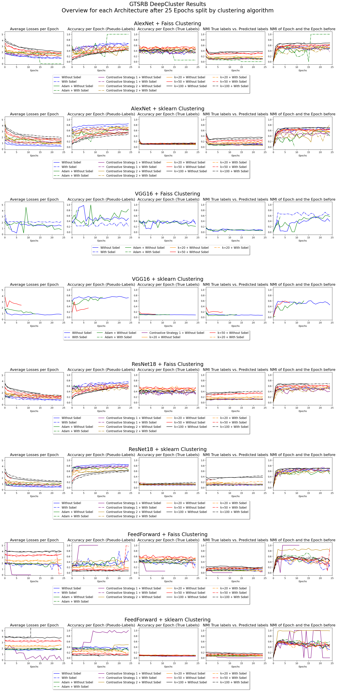

# GTSRB

Default Inputs:
- Model: either use no Sobel or use Sobel, additionally requires to grayscale the images
- Optimizers: There are two optimizers used by DeepCluster
  - for all parameters, default is Stochastic Gradient Descent (SGD) and additionally Adam is used to compare differences
  - only for the models top layer parameters, default is SGD and additionally Adam is used to compare differences
  - SGD Parameters:
    - learning rate: 0.05
    - momentum: 0.9
    - weight decay: 10^-5
  - Adam Parameters:
    - learning rate: 0.05
    - beta1: 0.9
    - beta2: 0.999
    - momentum: 0.9
    - weight decay: 10^-5
- Loss function: Cross Entropy



#### AlexNet
**Without Sobel**:
```bash
python3 main.py --arch AlexNet --input_dim 3 --num_classes 10 --epochs 25 --requires_grad --dataset GTSRB --ds_train --batch_size 128 --reassign_optimizer_tl --pca --pca_method faiss --pca_whitening --clustering faiss --metrics --metrics_dir ./metrics/GTSRB/5_runs_100_epochs/ -v --remove_head; python3 main.py --arch AlexNet --input_dim 3 --num_classes 10 --epochs 25 --requires_grad --dataset GTSRB --ds_train --batch_size 128 --reassign_optimizer_tl --pca --pca_method sklearn --pca_whitening --clustering faiss --metrics --metrics_dir ./metrics/GTSRB/5_runs_100_epochs/ -v --remove_head; python3 main.py --arch AlexNet --input_dim 3 --num_classes 10 --epochs 25 --requires_grad --dataset GTSRB --ds_train --batch_size 128 --reassign_optimizer_tl --pca --pca_method faiss --pca_whitening --clustering sklearn --metrics --metrics_dir ./metrics/GTSRB/5_runs_100_epochs/ -v --remove_head; python3 main.py --arch AlexNet --input_dim 3 --num_classes 10 --epochs 25 --requires_grad --dataset GTSRB --ds_train --batch_size 128 --reassign_optimizer_tl --pca --pca_method sklearn --pca_whitening --clustering sklearn --metrics --metrics_dir ./metrics/GTSRB/5_runs_100_epochs/ -v --remove_head;
```

**With Sobel**:
```bash
python3 main.py --arch AlexNet --input_dim 2 --grayscale --sobel --num_classes 10 --epochs 25 --requires_grad --dataset GTSRB --ds_train --batch_size 128 --reassign_optimizer_tl --pca --pca_method faiss --pca_whitening --clustering faiss --metrics --metrics_dir ./metrics/GTSRB/5_runs_100_epochs/ -v --remove_head; python3 main.py --arch AlexNet --input_dim 2 --grayscale --sobel --num_classes 10 --epochs 25 --requires_grad --dataset GTSRB --ds_train --batch_size 128 --reassign_optimizer_tl --pca --pca_method sklearn --pca_whitening --clustering faiss --metrics --metrics_dir ./metrics/GTSRB/5_runs_100_epochs/ -v --remove_head; python3 main.py --arch AlexNet --input_dim 2 --grayscale --sobel --num_classes 10 --epochs 25 --requires_grad --dataset GTSRB --ds_train --batch_size 128 --reassign_optimizer_tl --pca --pca_method faiss --pca_whitening --clustering sklearn --metrics --metrics_dir ./metrics/GTSRB/5_runs_100_epochs/ -v --remove_head; python3 main.py --arch AlexNet --input_dim 2 --grayscale --sobel --num_classes 10 --epochs 25 --requires_grad --dataset GTSRB --ds_train --batch_size 128 --reassign_optimizer_tl --pca --pca_method sklearn --pca_whitening --clustering sklearn --metrics --metrics_dir ./metrics/GTSRB/5_runs_100_epochs/ -v --remove_head;
```

**Adjusted class size**
```bash
for i in 20 50 100; do python3 main.py --arch AlexNet --input_dim 3 --num_classes $i --epochs 25 --requires_grad --dataset GTSRB --ds_train --batch_size 128 --reassign_optimizer_tl --pca --pca_method faiss --pca_whitening --clustering faiss --metrics --metrics_dir ./metrics/GTSRB/5_runs_100_epochs/ -v --remove_head; python3 main.py --arch AlexNet --input_dim 3 --num_classes $i --epochs 25 --requires_grad --dataset GTSRB --ds_train --batch_size 128 --reassign_optimizer_tl --pca --pca_method faiss --pca_whitening --clustering sklearn --metrics --metrics_dir ./metrics/GTSRB/5_runs_100_epochs/ -v --remove_head; python3 main.py --arch AlexNet --input_dim 2 --num_classes $i --grayscale --sobel --epochs 25 --requires_grad --dataset GTSRB --ds_train --batch_size 128 --reassign_optimizer_tl --pca --pca_method faiss --pca_whitening --clustering faiss --metrics --metrics_dir ./metrics/GTSRB/5_runs_100_epochs/ -v --remove_head; python3 main.py --arch AlexNet --input_dim 2 --num_classes $i --grayscale --sobel --epochs 25 --requires_grad --dataset GTSRB --ds_train --batch_size 128 --reassign_optimizer_tl --pca --pca_method faiss --pca_whitening --clustering sklearn --metrics --metrics_dir ./metrics/GTSRB/5_runs_100_epochs/ -v --remove_head; done
```
---

#### VGG16
**Without Sobel**:
```bash
python3 main.py --arch VGG16 --input_dim 3 --num_classes 10 --epochs 25 --requires_grad --dataset GTSRB --ds_train --batch_size 32 --reassign_optimizer_tl --pca --pca_method faiss --pca_whitening --clustering faiss --metrics --metrics_dir ./metrics/GTSRB/5_runs_100_epochs/ -v --remove_head; python3 main.py --arch VGG16 --input_dim 3 --num_classes 10 --epochs 25 --requires_grad --dataset GTSRB --ds_train --batch_size 32 --reassign_optimizer_tl --pca --pca_method sklearn --pca_whitening --clustering faiss --metrics --metrics_dir ./metrics/GTSRB/5_runs_100_epochs/ -v --remove_head; python3 main.py --arch VGG16 --input_dim 3 --num_classes 10 --epochs 25 --requires_grad --dataset GTSRB --ds_train --batch_size 32 --reassign_optimizer_tl --pca --pca_method faiss --pca_whitening --clustering sklearn --metrics --metrics_dir ./metrics/GTSRB/5_runs_100_epochs/ -v --remove_head; python3 main.py --arch VGG16 --input_dim 3 --num_classes 10 --epochs 25 --requires_grad --dataset GTSRB --ds_train --batch_size 32 --reassign_optimizer_tl --pca --pca_method sklearn --pca_whitening --clustering sklearn --metrics --metrics_dir ./metrics/GTSRB/5_runs_100_epochs/ -v --remove_head; 
```

**With Sobel**:
```bash
python3 main.py --arch VGG16 --input_dim 2 --grayscale --sobel --num_classes 10 --epochs 25 --requires_grad --dataset GTSRB --ds_train --batch_size 32 --reassign_optimizer_tl --pca --pca_method faiss --pca_whitening --clustering faiss --metrics --metrics_dir ./metrics/GTSRB/5_runs_100_epochs/ -v --remove_head; python3 main.py --arch VGG16 --input_dim 2 --grayscale --sobel --num_classes 10 --epochs 25 --requires_grad --dataset GTSRB --ds_train --batch_size 32 --reassign_optimizer_tl --pca --pca_method sklearn --pca_whitening --clustering faiss --metrics --metrics_dir ./metrics/GTSRB/5_runs_100_epochs/ -v --remove_head; python3 main.py --arch VGG16 --input_dim 2 --grayscale --sobel --num_classes 10 --epochs 25 --requires_grad --dataset GTSRB --ds_train --batch_size 32 --reassign_optimizer_tl --pca --pca_method faiss --pca_whitening --clustering sklearn --metrics --metrics_dir ./metrics/GTSRB/5_runs_100_epochs/ -v --remove_head; python3 main.py --arch VGG16 --input_dim 2 --grayscale --sobel --num_classes 10 --epochs 25 --requires_grad --dataset GTSRB --ds_train --batch_size 32 --reassign_optimizer_tl --pca --pca_method sklearn --pca_whitening --clustering sklearn --metrics --metrics_dir ./metrics/GTSRB/5_runs_100_epochs/ -v --remove_head; 
```

**Adjusted class size**
```bash (diatomit)
for i in 20 50 100; do python3 main.py --arch VGG16 --input_dim 3 --num_classes $i --epochs 25 --requires_grad --dataset GTSRB --ds_train --batch_size 32 --reassign_optimizer_tl --pca --pca_method faiss --pca_whitening --clustering faiss --metrics --metrics_dir ./metrics/GTSRB/5_runs_100_epochs/ -v --remove_head; python3 main.py --arch VGG16 --input_dim 3 --num_classes $i --epochs 25 --requires_grad --dataset GTSRB --ds_train --batch_size 32 --reassign_optimizer_tl --pca --pca_method faiss --pca_whitening --clustering sklearn --metrics --metrics_dir ./metrics/GTSRB/5_runs_100_epochs/ -v --remove_head; python3 main.py --arch VGG16 --input_dim 2 --num_classes $i --grayscale --sobel --epochs 25 --requires_grad --dataset GTSRB --ds_train --batch_size 32 --reassign_optimizer_tl --pca --pca_method faiss --pca_whitening --clustering faiss --metrics --metrics_dir ./metrics/GTSRB/5_runs_100_epochs/ -v --remove_head; python3 main.py --arch VGG16 --input_dim 2 --num_classes $i --grayscale --sobel --epochs 25 --requires_grad --dataset GTSRB --ds_train --batch_size 32 --reassign_optimizer_tl --pca --pca_method faiss --pca_whitening --clustering sklearn --metrics --metrics_dir ./metrics/GTSRB/5_runs_100_epochs/ -v --remove_head; done
```

---

#### ResNet18
**Without Sobel**:
```bash
python3 main.py --arch ResNet18 --input_dim 3 --num_classes 10 --epochs 25 --requires_grad --dataset GTSRB --ds_train --batch_size 128 --reassign_optimizer_tl --pca --pca_method faiss --pca_whitening --clustering faiss --metrics --metrics_dir ./metrics/GTSRB/5_runs_100_epochs/ -v --remove_head; python3 main.py --arch ResNet18 --input_dim 3 --num_classes 10 --epochs 25 --requires_grad --dataset GTSRB --ds_train --batch_size 128 --reassign_optimizer_tl --pca --pca_method sklearn --pca_whitening --clustering faiss --metrics --metrics_dir ./metrics/GTSRB/5_runs_100_epochs/ -v --remove_head; python3 main.py --arch ResNet18 --input_dim 3 --num_classes 10 --epochs 25 --requires_grad --dataset GTSRB --ds_train --batch_size 128 --reassign_optimizer_tl --pca --pca_method faiss --pca_whitening --clustering sklearn --metrics --metrics_dir ./metrics/GTSRB/5_runs_100_epochs/ -v --remove_head; python3 main.py --arch ResNet18 --input_dim 3 --num_classes 10 --epochs 25 --requires_grad --dataset GTSRB --ds_train --batch_size 128 --reassign_optimizer_tl --pca --pca_method sklearn --pca_whitening --clustering sklearn --metrics --metrics_dir ./metrics/GTSRB/5_runs_100_epochs/ -v --remove_head; 
```

**With Sobel**:
```bash
python3 main.py --arch ResNet18 --input_dim 2 --grayscale --sobel --num_classes 10 --epochs 25 --requires_grad --dataset GTSRB --ds_train --batch_size 128 --reassign_optimizer_tl --pca --pca_method faiss --pca_whitening --clustering faiss --metrics --metrics_dir ./metrics/GTSRB/5_runs_100_epochs/ -v --remove_head; python3 main.py --arch ResNet18 --input_dim 2 --grayscale --sobel --num_classes 10 --epochs 25 --requires_grad --dataset GTSRB --ds_train --batch_size 128 --reassign_optimizer_tl --pca --pca_method sklearn --pca_whitening --clustering faiss --metrics --metrics_dir ./metrics/GTSRB/5_runs_100_epochs/ -v --remove_head; python3 main.py --arch ResNet18 --input_dim 2 --grayscale --sobel --num_classes 10 --epochs 25 --requires_grad --dataset GTSRB --ds_train --batch_size 128 --reassign_optimizer_tl --pca --pca_method faiss --pca_whitening --clustering sklearn --metrics --metrics_dir ./metrics/GTSRB/5_runs_100_epochs/ -v --remove_head; python3 main.py --arch ResNet18 --input_dim 2 --grayscale --sobel --num_classes 10 --epochs 25 --requires_grad --dataset GTSRB --ds_train --batch_size 128 --reassign_optimizer_tl --pca --pca_method sklearn --pca_whitening --clustering sklearn --metrics --metrics_dir ./metrics/GTSRB/5_runs_100_epochs/ -v --remove_head; 
```

**Adjusted class size**
```bash (enderbit)
for i in 20 50 100; do python3 main.py --arch ResNet18 --input_dim 3 --num_classes $i --epochs 25 --requires_grad --dataset GTSRB --ds_train --batch_size 128 --reassign_optimizer_tl --pca --pca_method faiss --pca_whitening --clustering faiss --metrics --metrics_dir ./metrics/GTSRB/5_runs_100_epochs/ -v --remove_head; python3 main.py --arch ResNet18 --input_dim 3 --num_classes $i --epochs 25 --requires_grad --dataset GTSRB --ds_train --batch_size 128 --reassign_optimizer_tl --pca --pca_method faiss --pca_whitening --clustering sklearn --metrics --metrics_dir ./metrics/GTSRB/5_runs_100_epochs/ -v --remove_head; python3 main.py --arch ResNet18 --input_dim 2 --num_classes $i --grayscale --sobel --epochs 25 --requires_grad --dataset GTSRB --ds_train --batch_size 128 --reassign_optimizer_tl --pca --pca_method faiss --pca_whitening --clustering faiss --metrics --metrics_dir ./metrics/GTSRB/5_runs_100_epochs/ -v --remove_head; python3 main.py --arch ResNet18 --input_dim 2 --num_classes $i --grayscale --sobel --epochs 25 --requires_grad --dataset GTSRB --ds_train --batch_size 128 --reassign_optimizer_tl --pca --pca_method faiss --pca_whitening --clustering sklearn --metrics --metrics_dir ./metrics/GTSRB/5_runs_100_epochs/ -v --remove_head; done
```

---

#### FeedForward (Without PCA due to lower Feature Space)
**Without Sobel**:
```bash
python3 main.py --arch FeedForward --input_dim 3 --num_classes 10 --epochs 25 --requires_grad --dataset GTSRB --ds_train --batch_size 128 --reassign_optimizer_tl --clustering faiss --metrics --metrics_dir ./metrics/GTSRB/5_runs_100_epochs/ -v --remove_head; python3 main.py --arch FeedForward --input_dim 3 --num_classes 10 --epochs 25 --requires_grad --dataset GTSRB --ds_train --batch_size 128 --reassign_optimizer_tl --clustering sklearn --metrics --metrics_dir ./metrics/GTSRB/5_runs_100_epochs/ -v --remove_head; 
```

**With Sobel**:
```bash
python3 main.py --arch FeedForward --input_dim 2 --grayscale --sobel --num_classes 10 --epochs 25 --requires_grad --dataset GTSRB --ds_train --batch_size 128 --reassign_optimizer_tl --clustering faiss --metrics --metrics_dir ./metrics/GTSRB/5_runs_100_epochs/ -v --remove_head; python3 main.py --arch FeedForward --input_dim 2 --grayscale --sobel --num_classes 10 --epochs 25 --requires_grad --dataset GTSRB --ds_train --batch_size 128 --reassign_optimizer_tl --clustering sklearn --metrics --metrics_dir ./metrics/GTSRB/5_runs_100_epochs/ -v --remove_head; 
```

**Adjusted class size**
```bash
for i in 20 50 100; do python3 main.py --arch FeedForward --input_dim 3 --num_classes $i --epochs 25 --requires_grad --dataset GTSRB --ds_train --batch_size 128 --reassign_optimizer_tl --clustering faiss --metrics --metrics_dir ./metrics/GTSRB/5_runs_100_epochs/ -v --remove_head; python3 main.py --arch FeedForward --input_dim 3 --num_classes $i --epochs 25 --requires_grad --dataset GTSRB --ds_train --batch_size 128 --reassign_optimizer_tl --clustering sklearn --metrics --metrics_dir ./metrics/GTSRB/5_runs_100_epochs/ -v --remove_head; python3 main.py --arch FeedForward --input_dim 2 --num_classes $i --grayscale --sobel --epochs 25 --requires_grad --dataset GTSRB --ds_train --batch_size 128 --reassign_optimizer_tl --clustering faiss --metrics --metrics_dir ./metrics/GTSRB/5_runs_100_epochs/ -v --remove_head; python3 main.py --arch FeedForward --input_dim 2 --num_classes $i --grayscale --sobel --epochs 25 --requires_grad --dataset GTSRB --ds_train --batch_size 128 --reassign_optimizer_tl --clustering sklearn --metrics --metrics_dir ./metrics/GTSRB/5_runs_100_epochs/ -v --remove_head; done
```

---

## Adam Optimizer
**Without Sobel**
```bash (enderbit)
python3 main.py --arch AlexNet --input_dim 3 --num_classes 10 --epochs 25 --requires_grad --dataset GTSRB --ds_train --batch_size 128 --reassign_optimizer_tl --pca --pca_method faiss --pca_whitening --clustering faiss --metrics --metrics_dir ./metrics/GTSRB/5_runs_100_epochs/ -v --optimizer Adam --optimizer_tl Adam; python3 main.py --arch AlexNet --input_dim 3 --num_classes 10 --epochs 25 --requires_grad --dataset GTSRB --ds_train --batch_size 128 --reassign_optimizer_tl --pca --pca_method sklearn --pca_whitening --clustering sklearn --metrics --metrics_dir ./metrics/GTSRB/5_runs_100_epochs/ -v --optimizer Adam --optimizer_tl Adam; python3 main.py --arch VGG16 --input_dim 3 --num_classes 10 --epochs 25 --requires_grad --dataset GTSRB --ds_train --batch_size 32 --reassign_optimizer_tl --pca --pca_method faiss --pca_whitening --clustering faiss --metrics --metrics_dir ./metrics/GTSRB/5_runs_100_epochs/ -v --optimizer Adam --optimizer_tl Adam; python3 main.py --arch VGG16 --input_dim 3 --num_classes 10 --epochs 25 --requires_grad --dataset GTSRB --ds_train --batch_size 32 --reassign_optimizer_tl --pca --pca_method sklearn --pca_whitening --clustering sklearn --metrics --metrics_dir ./metrics/GTSRB/5_runs_100_epochs/ -v --optimizer Adam --optimizer_tl Adam; python3 main.py --arch ResNet18 --input_dim 3 --num_classes 10 --epochs 25 --requires_grad --dataset GTSRB --ds_train --batch_size 128 --reassign_optimizer_tl --pca --pca_method faiss --pca_whitening --clustering faiss --metrics --metrics_dir ./metrics/GTSRB/5_runs_100_epochs/ -v --optimizer Adam --optimizer_tl Adam; python3 main.py --arch ResNet18 --input_dim 3 --num_classes 10 --epochs 25 --requires_grad --dataset GTSRB --ds_train --batch_size 128 --reassign_optimizer_tl --pca --pca_method sklearn --pca_whitening --clustering sklearn --metrics --metrics_dir ./metrics/GTSRB/5_runs_100_epochs/ -v --optimizer Adam --optimizer_tl Adam; python3 main.py --arch FeedForward --input_dim 3 --num_classes 10 --epochs 25 --requires_grad --dataset GTSRB --ds_train --batch_size 128 --reassign_optimizer_tl --clustering faiss --metrics --metrics_dir ./metrics/GTSRB/5_runs_100_epochs/ -v --optimizer Adam --optimizer_tl Adam; python3 main.py --arch FeedForward --input_dim 3 --num_classes 10 --epochs 25 --requires_grad --dataset GTSRB --ds_train --batch_size 128 --reassign_optimizer_tl --clustering sklearn --metrics --metrics_dir ./metrics/GTSRB/5_runs_100_epochs/ -v --optimizer Adam --optimizer_tl Adam;
```

lr and wd adjusted
```bash
python3 main.py --arch AlexNet --input_dim 3 --num_classes 10 --epochs 25 --requires_grad --dataset GTSRB --ds_train --batch_size 128 --reassign_optimizer_tl --pca --pca_method faiss --pca_whitening --clustering faiss --metrics --metrics_dir ./metrics/GTSRB/5_runs_100_epochs/ -v --optimizer Adam --optimizer_tl Adam --lr 0.001 --lr_tl 0.001 --weight_decay 0 --weight_decay_tl 0; python3 main.py --arch AlexNet --input_dim 3 --num_classes 10 --epochs 25 --requires_grad --dataset GTSRB --ds_train --batch_size 128 --reassign_optimizer_tl --pca --pca_method sklearn --pca_whitening --clustering sklearn --metrics --metrics_dir ./metrics/GTSRB/5_runs_100_epochs/ -v --optimizer Adam --optimizer_tl Adam --lr 0.001 --lr_tl 0.001 --weight_decay 0 --weight_decay_tl 0; python3 main.py --arch VGG16 --input_dim 3 --num_classes 10 --epochs 25 --requires_grad --dataset GTSRB --ds_train --batch_size 32 --reassign_optimizer_tl --pca --pca_method faiss --pca_whitening --clustering faiss --metrics --metrics_dir ./metrics/GTSRB/5_runs_100_epochs/ -v --optimizer Adam --optimizer_tl Adam --lr 0.001 --lr_tl 0.001 --weight_decay 0 --weight_decay_tl 0; python3 main.py --arch VGG16 --input_dim 3 --num_classes 10 --epochs 25 --requires_grad --dataset GTSRB --ds_train --batch_size 32 --reassign_optimizer_tl --pca --pca_method sklearn --pca_whitening --clustering sklearn --metrics --metrics_dir ./metrics/GTSRB/5_runs_100_epochs/ -v --optimizer Adam --optimizer_tl Adam --lr 0.001 --lr_tl 0.001 --weight_decay 0 --weight_decay_tl 0; 

(diatomit)
python3 main.py --arch ResNet18 --input_dim 3 --num_classes 10 --epochs 25 --requires_grad --dataset GTSRB --ds_train --batch_size 128 --reassign_optimizer_tl --pca --pca_method faiss --pca_whitening --clustering faiss --metrics --metrics_dir ./metrics/GTSRB/5_runs_100_epochs/ -v --optimizer Adam --optimizer_tl Adam --lr 0.001 --lr_tl 0.001 --weight_decay 0 --weight_decay_tl 0; python3 main.py --arch ResNet18 --input_dim 3 --num_classes 10 --epochs 25 --requires_grad --dataset GTSRB --ds_train --batch_size 128 --reassign_optimizer_tl --pca --pca_method sklearn --pca_whitening --clustering sklearn --metrics --metrics_dir ./metrics/GTSRB/5_runs_100_epochs/ -v --optimizer Adam --optimizer_tl Adam --lr 0.001 --lr_tl 0.001 --weight_decay 0 --weight_decay_tl 0; python3 main.py --arch FeedForward --input_dim 3 --num_classes 10 --epochs 25 --requires_grad --dataset GTSRB --ds_train --batch_size 128 --reassign_optimizer_tl --clustering faiss --metrics --metrics_dir ./metrics/GTSRB/5_runs_100_epochs/ -v --optimizer Adam --optimizer_tl Adam --lr 0.001 --lr_tl 0.001 --weight_decay 0 --weight_decay_tl 0; python3 main.py --arch FeedForward --input_dim 3 --num_classes 10 --epochs 25 --requires_grad --dataset GTSRB --ds_train --batch_size 128 --reassign_optimizer_tl --clustering sklearn --metrics --metrics_dir ./metrics/GTSRB/5_runs_100_epochs/ -v --optimizer Adam --optimizer_tl Adam --lr 0.001 --lr_tl 0.001 --weight_decay 0 --weight_decay_tl 0;
```

**With Sobel**
```bash
python3 main.py --arch AlexNet --input_dim 2 --num_classes 10 --epochs 25 --requires_grad --dataset GTSRB --ds_train --batch_size 128 --reassign_optimizer_tl --pca --pca_method faiss --pca_whitening --clustering faiss --metrics --metrics_dir ./metrics/GTSRB/5_runs_100_epochs/ -v --optimizer Adam --optimizer_tl Adam --sobel --grayscale; 

(diatomit)
python3 main.py --arch AlexNet --input_dim 2 --num_classes 10 --epochs 25 --requires_grad --dataset GTSRB --ds_train --batch_size 128 --reassign_optimizer_tl --pca --pca_method sklearn --pca_whitening --clustering sklearn --metrics --metrics_dir ./metrics/GTSRB/5_runs_100_epochs/ -v --optimizer Adam --optimizer_tl Adam --sobel --grayscale; 

python3 main.py --arch VGG16 --input_dim 2 --num_classes 10 --epochs 25 --requires_grad --dataset GTSRB --ds_train --batch_size 32 --reassign_optimizer_tl --pca --pca_method faiss --pca_whitening --clustering faiss --metrics --metrics_dir ./metrics/GTSRB/5_runs_100_epochs/ -v --optimizer Adam --optimizer_tl Adam --sobel --grayscale; python3 main.py --arch VGG16 --input_dim 2 --num_classes 10 --epochs 25 --requires_grad --dataset GTSRB --ds_train --batch_size 32 --reassign_optimizer_tl --pca --pca_method sklearn --pca_whitening --clustering sklearn --metrics --metrics_dir ./metrics/GTSRB/5_runs_100_epochs/ -v --optimizer Adam --optimizer_tl Adam --sobel --grayscale; python3 main.py --arch ResNet18 --input_dim 2 --num_classes 10 --epochs 25 --requires_grad --dataset GTSRB --ds_train --batch_size 128 --reassign_optimizer_tl --pca --pca_method faiss --pca_whitening --clustering faiss --metrics --metrics_dir ./metrics/GTSRB/5_runs_100_epochs/ -v --optimizer Adam --optimizer_tl Adam --sobel --grayscale; python3 main.py --arch ResNet18 --input_dim 2 --num_classes 10 --epochs 25 --requires_grad --dataset GTSRB --ds_train --batch_size 128 --reassign_optimizer_tl --pca --pca_method sklearn --pca_whitening --clustering sklearn --metrics --metrics_dir ./metrics/GTSRB/5_runs_100_epochs/ -v --optimizer Adam --optimizer_tl Adam --sobel --grayscale; python3 main.py --arch FeedForward --input_dim 2 --num_classes 10 --epochs 25 --requires_grad --dataset GTSRB --ds_train --batch_size 128 --reassign_optimizer_tl --clustering faiss --metrics --metrics_dir ./metrics/GTSRB/5_runs_100_epochs/ -v --optimizer Adam --optimizer_tl Adam --sobel --grayscale; python3 main.py --arch FeedForward --input_dim 2 --num_classes 10 --epochs 25 --requires_grad --dataset GTSRB --ds_train --batch_size 128 --reassign_optimizer_tl --clustering sklearn --metrics --metrics_dir ./metrics/GTSRB/5_runs_100_epochs/ -v --optimizer Adam --optimizer_tl Adam --sobel --grayscale;
```

lr & wd adjusted
```bash (aplit)
python3 main.py --arch AlexNet --input_dim 2 --num_classes 10 --epochs 25 --requires_grad --dataset GTSRB --ds_train --batch_size 128 --reassign_optimizer_tl --pca --pca_method faiss --pca_whitening --clustering faiss --metrics --metrics_dir ./metrics/GTSRB/5_runs_100_epochs/ -v --optimizer Adam --optimizer_tl Adam --sobel --grayscale --lr 0.001 --lr_tl 0.001 --weight_decay 0 --weight_decay_tl 0; python3 main.py --arch AlexNet --input_dim 2 --num_classes 10 --epochs 25 --requires_grad --dataset GTSRB --ds_train --batch_size 128 --reassign_optimizer_tl --pca --pca_method sklearn --pca_whitening --clustering sklearn --metrics --metrics_dir ./metrics/GTSRB/5_runs_100_epochs/ -v --optimizer Adam --optimizer_tl Adam --sobel --grayscale --lr 0.001 --lr_tl 0.001 --weight_decay 0 --weight_decay_tl 0; python3 main.py --arch VGG16 --input_dim 2 --num_classes 10 --epochs 25 --requires_grad --dataset GTSRB --ds_train --batch_size 32 --reassign_optimizer_tl --pca --pca_method faiss --pca_whitening --clustering faiss --metrics --metrics_dir ./metrics/GTSRB/5_runs_100_epochs/ -v --optimizer Adam --optimizer_tl Adam --sobel --grayscale --lr 0.001 --lr_tl 0.001 --weight_decay 0 --weight_decay_tl 0; python3 main.py --arch VGG16 --input_dim 2 --num_classes 10 --epochs 25 --requires_grad --dataset GTSRB --ds_train --batch_size 32 --reassign_optimizer_tl --pca --pca_method sklearn --pca_whitening --clustering sklearn --metrics --metrics_dir ./metrics/GTSRB/5_runs_100_epochs/ -v --optimizer Adam --optimizer_tl Adam --sobel --grayscale --lr 0.001 --lr_tl 0.001 --weight_decay 0 --weight_decay_tl 0; python3 main.py --arch ResNet18 --input_dim 2 --num_classes 10 --epochs 25 --requires_grad --dataset GTSRB --ds_train --batch_size 128 --reassign_optimizer_tl --pca --pca_method faiss --pca_whitening --clustering faiss --metrics --metrics_dir ./metrics/GTSRB/5_runs_100_epochs/ -v --optimizer Adam --optimizer_tl Adam --sobel --grayscale --lr 0.001 --lr_tl 0.001 --weight_decay 0 --weight_decay_tl 0; python3 main.py --arch ResNet18 --input_dim 2 --num_classes 10 --epochs 25 --requires_grad --dataset GTSRB --ds_train --batch_size 128 --reassign_optimizer_tl --pca --pca_method sklearn --pca_whitening --clustering sklearn --metrics --metrics_dir ./metrics/GTSRB/5_runs_100_epochs/ -v --optimizer Adam --optimizer_tl Adam --sobel --grayscale --lr 0.001 --lr_tl 0.001 --weight_decay 0 --weight_decay_tl 0; 

(diamiktit)
python3 main.py --arch FeedForward --input_dim 2 --num_classes 10 --epochs 25 --requires_grad --dataset GTSRB --ds_train --batch_size 128 --reassign_optimizer_tl --clustering faiss --metrics --metrics_dir ./metrics/GTSRB/5_runs_100_epochs/ -v --optimizer Adam --optimizer_tl Adam --sobel --grayscale --lr 0.001 --lr_tl 0.001 --weight_decay 0 --weight_decay_tl 0; python3 main.py --arch FeedForward --input_dim 2 --num_classes 10 --epochs 25 --requires_grad --dataset GTSRB --ds_train --batch_size 128 --reassign_optimizer_tl --clustering sklearn --metrics --metrics_dir ./metrics/GTSRB/5_runs_100_epochs/ -v --optimizer Adam --optimizer_tl Adam --sobel --grayscale --lr 0.001 --lr_tl 0.001 --weight_decay 0 --weight_decay_tl 0;
```


---

## Contrastive Strategies

### Strategy 1
**Without Sobel**
```bash
python3 main.py --arch AlexNet --input_dim 3 --num_classes 10 --epochs 25 --requires_grad --dataset GTSRB --ds_train --batch_size 128 --reassign_optimizer_tl --pca --pca_method faiss --pca_whitening --clustering faiss --metrics --metrics_dir ./metrics/GTSRB/5_runs_100_epochs/ -v --contrastive_strategy_1; python3 main.py --arch AlexNet --input_dim 3 --num_classes 10 --epochs 25 --requires_grad --dataset GTSRB --ds_train --batch_size 128 --reassign_optimizer_tl --pca --pca_method sklearn --pca_whitening --clustering sklearn --metrics --metrics_dir ./metrics/GTSRB/5_runs_100_epochs/ -v --contrastive_strategy_1; python3 main.py --arch VGG16 --input_dim 3 --num_classes 10 --epochs 25 --requires_grad --dataset GTSRB --ds_train --batch_size 32 --reassign_optimizer_tl --pca --pca_method faiss --pca_whitening --clustering faiss --metrics --metrics_dir ./metrics/GTSRB/5_runs_100_epochs/ -v --contrastive_strategy_1; python3 main.py --arch VGG16 --input_dim 3 --num_classes 10 --epochs 25 --requires_grad --dataset GTSRB --ds_train --batch_size 32 --reassign_optimizer_tl --pca --pca_method sklearn --pca_whitening --clustering sklearn --metrics --metrics_dir ./metrics/GTSRB/5_runs_100_epochs/ -v --contrastive_strategy_1; python3 main.py --arch ResNet18 --input_dim 3 --num_classes 10 --epochs 25 --requires_grad --dataset GTSRB --ds_train --batch_size 128 --reassign_optimizer_tl --pca --pca_method faiss --pca_whitening --clustering faiss --metrics --metrics_dir ./metrics/GTSRB/5_runs_100_epochs/ -v --contrastive_strategy_1; python3 main.py --arch ResNet18 --input_dim 3 --num_classes 10 --epochs 25 --requires_grad --dataset GTSRB --ds_train --batch_size 128 --reassign_optimizer_tl --pca --pca_method sklearn --pca_whitening --clustering sklearn --metrics --metrics_dir ./metrics/GTSRB/5_runs_100_epochs/ -v --contrastive_strategy_1; python3 main.py --arch FeedForward --input_dim 3 --num_classes 10 --epochs 25 --requires_grad --dataset GTSRB --ds_train --batch_size 128 --reassign_optimizer_tl --clustering faiss --metrics --metrics_dir ./metrics/GTSRB/5_runs_100_epochs/ -v --contrastive_strategy_1; python3 main.py --arch FeedForward --input_dim 3 --num_classes 10 --epochs 25 --requires_grad --dataset GTSRB --ds_train --batch_size 128 --reassign_optimizer_tl --clustering sklearn --metrics --metrics_dir ./metrics/GTSRB/5_runs_100_epochs/ -v --contrastive_strategy_1;
```

**With Sobel**
```bash
python3 main.py --arch AlexNet --input_dim 2 --sobel --grayscale --num_classes 10 --epochs 25 --requires_grad --dataset GTSRB --ds_train --batch_size 128 --reassign_optimizer_tl --pca --pca_method faiss --pca_whitening --clustering faiss --metrics --metrics_dir ./metrics/GTSRB/5_runs_100_epochs/ -v --contrastive_strategy_1; python3 main.py --arch AlexNet --input_dim 2 --sobel --grayscale --num_classes 10 --epochs 25 --requires_grad --dataset GTSRB --ds_train --batch_size 128 --reassign_optimizer_tl --pca --pca_method sklearn --pca_whitening --clustering sklearn --metrics --metrics_dir ./metrics/GTSRB/5_runs_100_epochs/ -v --contrastive_strategy_1; python3 main.py --arch VGG16 --input_dim 2 --sobel --grayscale --num_classes 10 --epochs 25 --requires_grad --dataset GTSRB --ds_train --batch_size 32 --reassign_optimizer_tl --pca --pca_method faiss --pca_whitening --clustering faiss --metrics --metrics_dir ./metrics/GTSRB/5_runs_100_epochs/ -v --contrastive_strategy_1; python3 main.py --arch VGG16 --input_dim 2 --sobel --grayscale --num_classes 10 --epochs 25 --requires_grad --dataset GTSRB --ds_train --batch_size 32 --reassign_optimizer_tl --pca --pca_method sklearn --pca_whitening --clustering sklearn --metrics --metrics_dir ./metrics/GTSRB/5_runs_100_epochs/ -v --contrastive_strategy_1; python3 main.py --arch ResNet18 --input_dim 2 --sobel --grayscale --num_classes 10 --epochs 25 --requires_grad --dataset GTSRB --ds_train --batch_size 128 --reassign_optimizer_tl --pca --pca_method faiss --pca_whitening --clustering faiss --metrics --metrics_dir ./metrics/GTSRB/5_runs_100_epochs/ -v --contrastive_strategy_1; python3 main.py --arch ResNet18 --input_dim 2 --sobel --grayscale --num_classes 10 --epochs 25 --requires_grad --dataset GTSRB --ds_train --batch_size 128 --reassign_optimizer_tl --pca --pca_method sklearn --pca_whitening --clustering sklearn --metrics --metrics_dir ./metrics/GTSRB/5_runs_100_epochs/ -v --contrastive_strategy_1; python3 main.py --arch FeedForward --input_dim 2 --sobel --grayscale --num_classes 10 --epochs 25 --requires_grad --dataset GTSRB --ds_train --batch_size 128 --reassign_optimizer_tl --clustering faiss --metrics --metrics_dir ./metrics/GTSRB/5_runs_100_epochs/ -v --contrastive_strategy_1; python3 main.py --arch FeedForward --input_dim 2 --sobel --grayscale --num_classes 10 --epochs 25 --requires_grad --dataset GTSRB --ds_train --batch_size 128 --reassign_optimizer_tl --clustering sklearn --metrics --metrics_dir ./metrics/GTSRB/5_runs_100_epochs/ -v --contrastive_strategy_1;
```


### Strategy 2
- RandomCrop 204px
- RandomRotation up to 30 degree
- ColorJitter

**Without Sobel**
```bash
python3 main.py --arch AlexNet --input_dim 3 --num_classes 10 --epochs 25 --requires_grad --dataset GTSRB --ds_train --batch_size 128 --reassign_optimizer_tl --pca --pca_method faiss --pca_whitening --clustering faiss --metrics --metrics_dir ./metrics/GTSRB/5_runs_100_epochs/ -v --contrastive_strategy_2 --augmentation_random_crop 204  --augmentation_random_rotation 30 --augmentation_color_jitter; python3 main.py --arch AlexNet --input_dim 3 --num_classes 10 --epochs 25 --requires_grad --dataset GTSRB --ds_train --batch_size 128 --reassign_optimizer_tl --pca --pca_method sklearn --pca_whitening --clustering sklearn --metrics --metrics_dir ./metrics/GTSRB/5_runs_100_epochs/ -v --contrastive_strategy_2 --augmentation_random_crop 204  --augmentation_random_rotation 30 --augmentation_color_jitter; python3 main.py --arch VGG16 --input_dim 3 --num_classes 10 --epochs 25 --requires_grad --dataset GTSRB --ds_train --batch_size 32 --reassign_optimizer_tl --pca --pca_method faiss --pca_whitening --clustering faiss --metrics --metrics_dir ./metrics/GTSRB/5_runs_100_epochs/ -v --contrastive_strategy_2 --augmentation_random_crop 204  --augmentation_random_rotation 30 --augmentation_color_jitter; python3 main.py --arch VGG16 --input_dim 3 --num_classes 10 --epochs 25 --requires_grad --dataset GTSRB --ds_train --batch_size 32 --reassign_optimizer_tl --pca --pca_method sklearn --pca_whitening --clustering sklearn --metrics --metrics_dir ./metrics/GTSRB/5_runs_100_epochs/ -v --contrastive_strategy_2 --augmentation_random_crop 204  --augmentation_random_rotation 30 --augmentation_color_jitter; python3 main.py --arch ResNet18 --input_dim 3 --num_classes 10 --epochs 25 --requires_grad --dataset GTSRB --ds_train --batch_size 128 --reassign_optimizer_tl --pca --pca_method faiss --pca_whitening --clustering faiss --metrics --metrics_dir ./metrics/GTSRB/5_runs_100_epochs/ -v --contrastive_strategy_2 --augmentation_random_crop 204  --augmentation_random_rotation 30 --augmentation_color_jitter; python3 main.py --arch ResNet18 --input_dim 3 --num_classes 10 --epochs 25 --requires_grad --dataset GTSRB --ds_train --batch_size 128 --reassign_optimizer_tl --pca --pca_method sklearn --pca_whitening --clustering sklearn --metrics --metrics_dir ./metrics/GTSRB/5_runs_100_epochs/ -v --contrastive_strategy_2 --augmentation_random_crop 204  --augmentation_random_rotation 30 --augmentation_color_jitter; python3 main.py --arch FeedForward --input_dim 3 --num_classes 10 --epochs 25 --requires_grad --dataset GTSRB --ds_train --batch_size 128 --reassign_optimizer_tl --clustering faiss --metrics --metrics_dir ./metrics/GTSRB/5_runs_100_epochs/ -v --contrastive_strategy_2 --augmentation_random_crop 204  --augmentation_random_rotation 30 --augmentation_color_jitter; python3 main.py --arch FeedForward --input_dim 3 --num_classes 10 --epochs 25 --requires_grad --dataset GTSRB --ds_train --batch_size 128 --reassign_optimizer_tl --clustering sklearn --metrics --metrics_dir ./metrics/GTSRB/5_runs_100_epochs/ -v --contrastive_strategy_2 --augmentation_random_crop 204  --augmentation_random_rotation 30 --augmentation_color_jitter;
```

**With Sobel**
```bash
(dolerit)
python3 main.py --arch AlexNet --input_dim 2 --sobel --grayscale --num_classes 10 --epochs 25 --requires_grad --dataset GTSRB --ds_train --batch_size 128 --reassign_optimizer_tl --pca --pca_method faiss --pca_whitening --clustering faiss --metrics --metrics_dir ./metrics/GTSRB/5_runs_100_epochs/ -v --contrastive_strategy_2 --augmentation_random_crop 204  --augmentation_random_rotation 30 --augmentation_color_jitter; python3 main.py --arch AlexNet --input_dim 2 --sobel --grayscale --num_classes 10 --epochs 25 --requires_grad --dataset GTSRB --ds_train --batch_size 128 --reassign_optimizer_tl --pca --pca_method sklearn --pca_whitening --clustering sklearn --metrics --metrics_dir ./metrics/GTSRB/5_runs_100_epochs/ -v --contrastive_strategy_2 --augmentation_random_crop 204  --augmentation_random_rotation 30 --augmentation_color_jitter; python3 main.py --arch VGG16 --input_dim 2 --sobel --grayscale --num_classes 10 --epochs 25 --requires_grad --dataset GTSRB --ds_train --batch_size 32 --reassign_optimizer_tl --pca --pca_method faiss --pca_whitening --clustering faiss --metrics --metrics_dir ./metrics/GTSRB/5_runs_100_epochs/ -v --contrastive_strategy_2 --augmentation_random_crop 204  --augmentation_random_rotation 30 --augmentation_color_jitter; python3 main.py --arch VGG16 --input_dim 2 --sobel --grayscale --num_classes 10 --epochs 25 --requires_grad --dataset GTSRB --ds_train --batch_size 32 --reassign_optimizer_tl --pca --pca_method sklearn --pca_whitening --clustering sklearn --metrics --metrics_dir ./metrics/GTSRB/5_runs_100_epochs/ -v --contrastive_strategy_2 --augmentation_random_crop 204  --augmentation_random_rotation 30 --augmentation_color_jitter; 

(diorit)
python3 main.py --arch ResNet18 --input_dim 2 --sobel --grayscale --num_classes 10 --epochs 25 --requires_grad --dataset GTSRB --ds_train --batch_size 128 --reassign_optimizer_tl --pca --pca_method faiss --pca_whitening --clustering faiss --metrics --metrics_dir ./metrics/GTSRB/5_runs_100_epochs/ -v --contrastive_strategy_2 --augmentation_random_crop 204  --augmentation_random_rotation 30 --augmentation_color_jitter; python3 main.py --arch ResNet18 --input_dim 2 --sobel --grayscale --num_classes 10 --epochs 25 --requires_grad --dataset GTSRB --ds_train --batch_size 128 --reassign_optimizer_tl --pca --pca_method sklearn --pca_whitening --clustering sklearn --metrics --metrics_dir ./metrics/GTSRB/5_runs_100_epochs/ -v --contrastive_strategy_2 --augmentation_random_crop 204  --augmentation_random_rotation 30 --augmentation_color_jitter; python3 main.py --arch FeedForward --input_dim 2 --sobel --grayscale --num_classes 10 --epochs 25 --requires_grad --dataset GTSRB --ds_train --batch_size 128 --reassign_optimizer_tl --clustering faiss --metrics --metrics_dir ./metrics/GTSRB/5_runs_100_epochs/ -v --contrastive_strategy_2 --augmentation_random_crop 204  --augmentation_random_rotation 30 --augmentation_color_jitter; python3 main.py --arch FeedForward --input_dim 2 --sobel --grayscale --num_classes 10 --epochs 25 --requires_grad --dataset GTSRB --ds_train --batch_size 128 --reassign_optimizer_tl --clustering sklearn --metrics --metrics_dir ./metrics/GTSRB/5_runs_100_epochs/ -v --contrastive_strategy_2 --augmentation_random_crop 204  --augmentation_random_rotation 30 --augmentation_color_jitter;
```