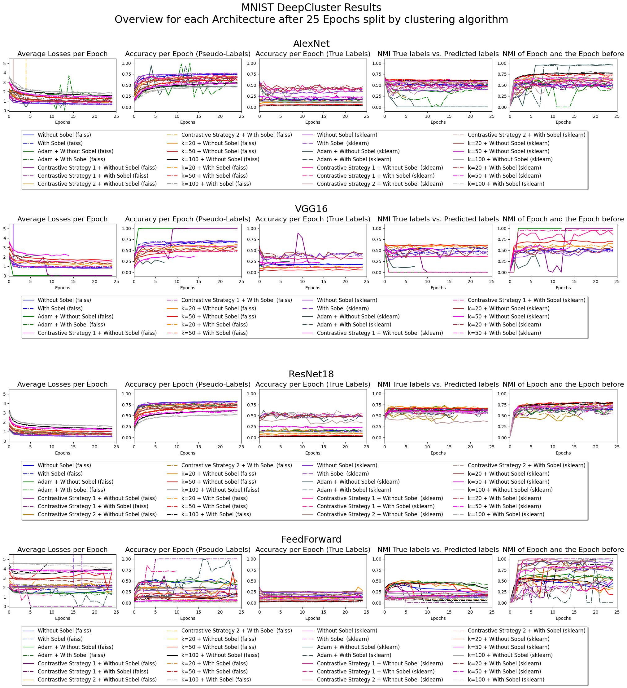
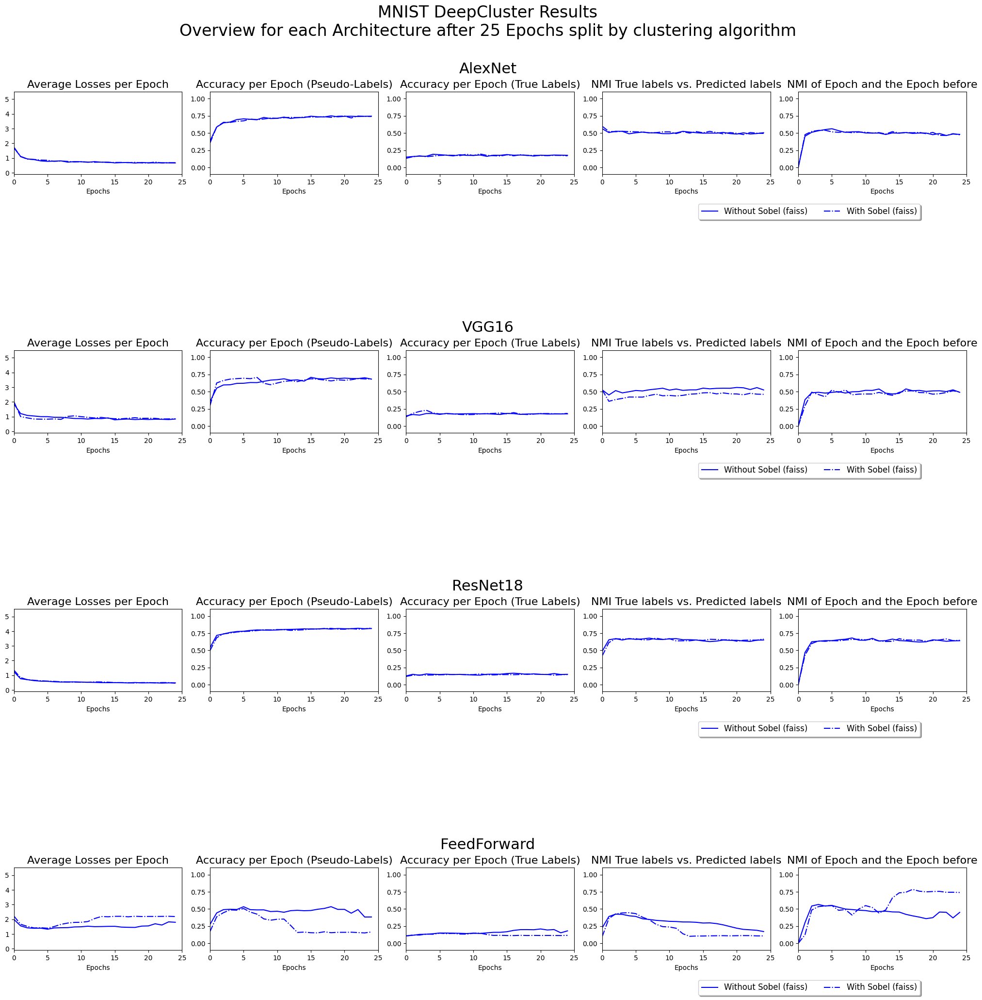
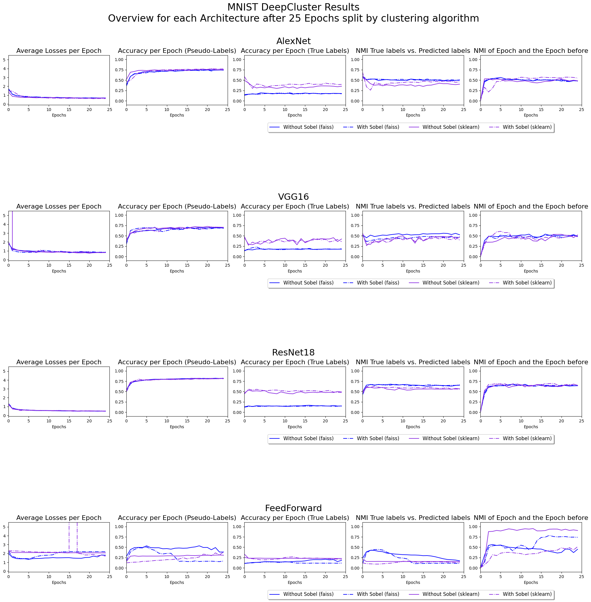
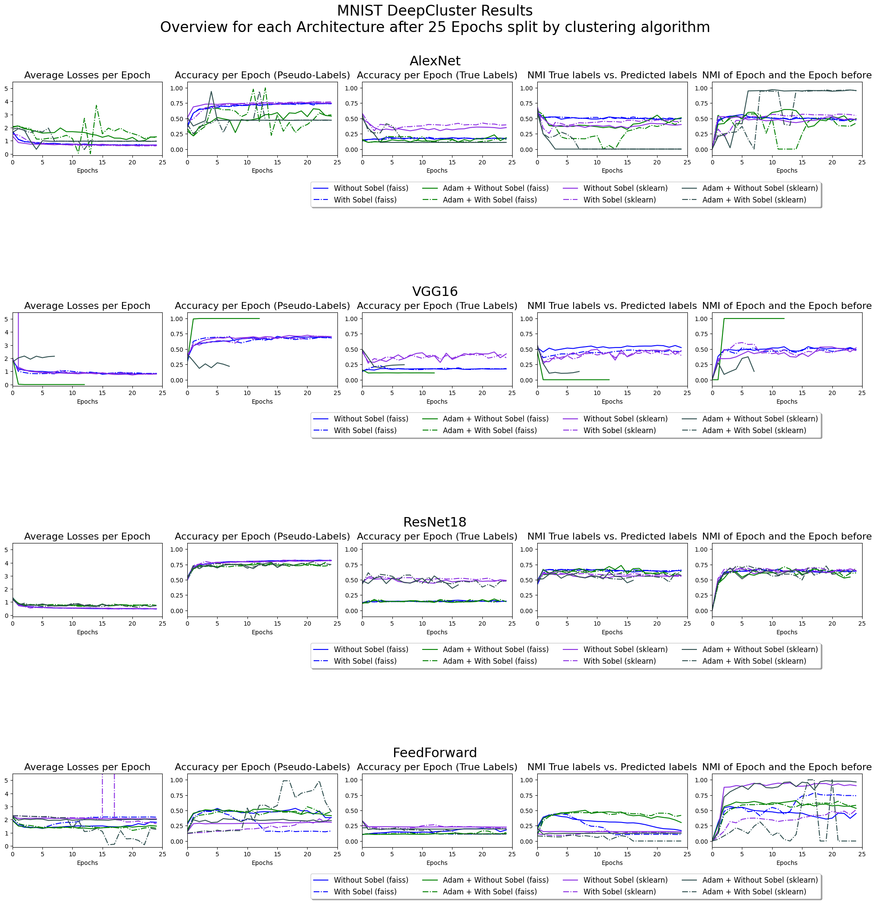
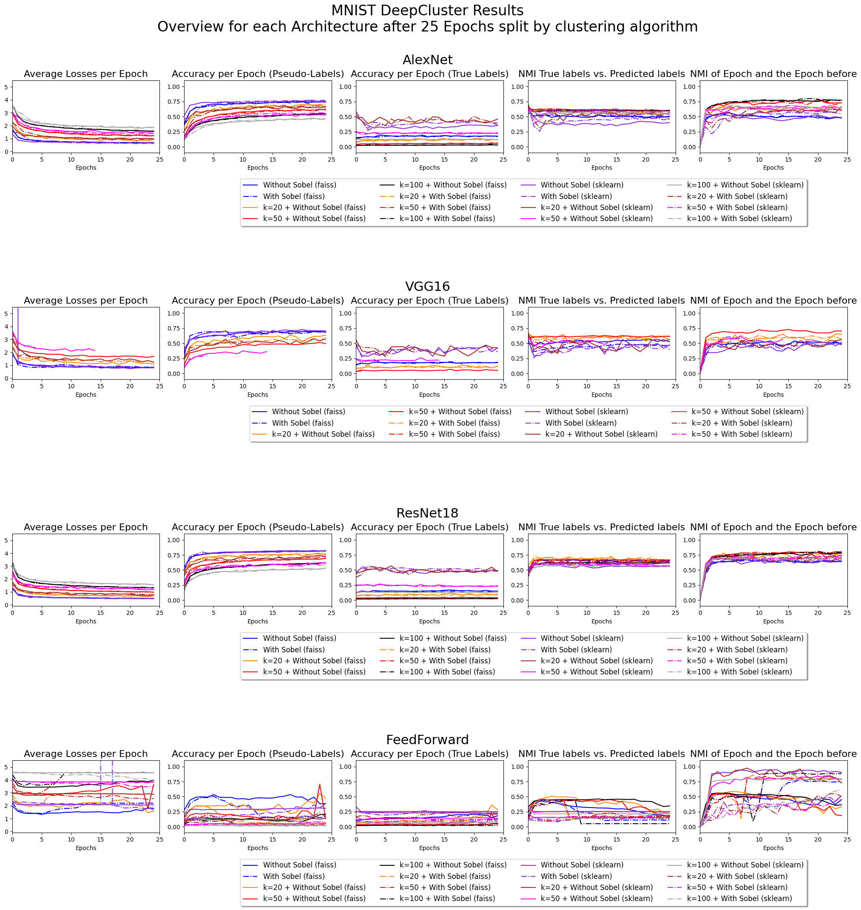
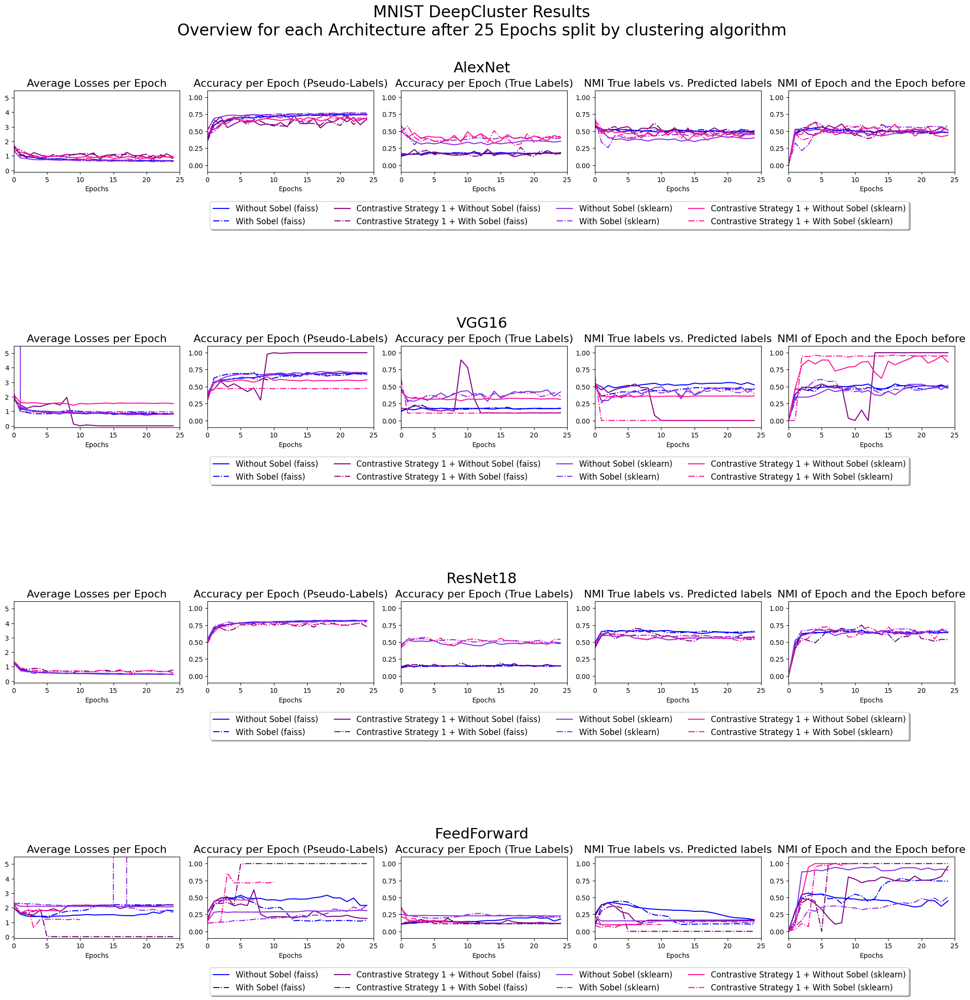
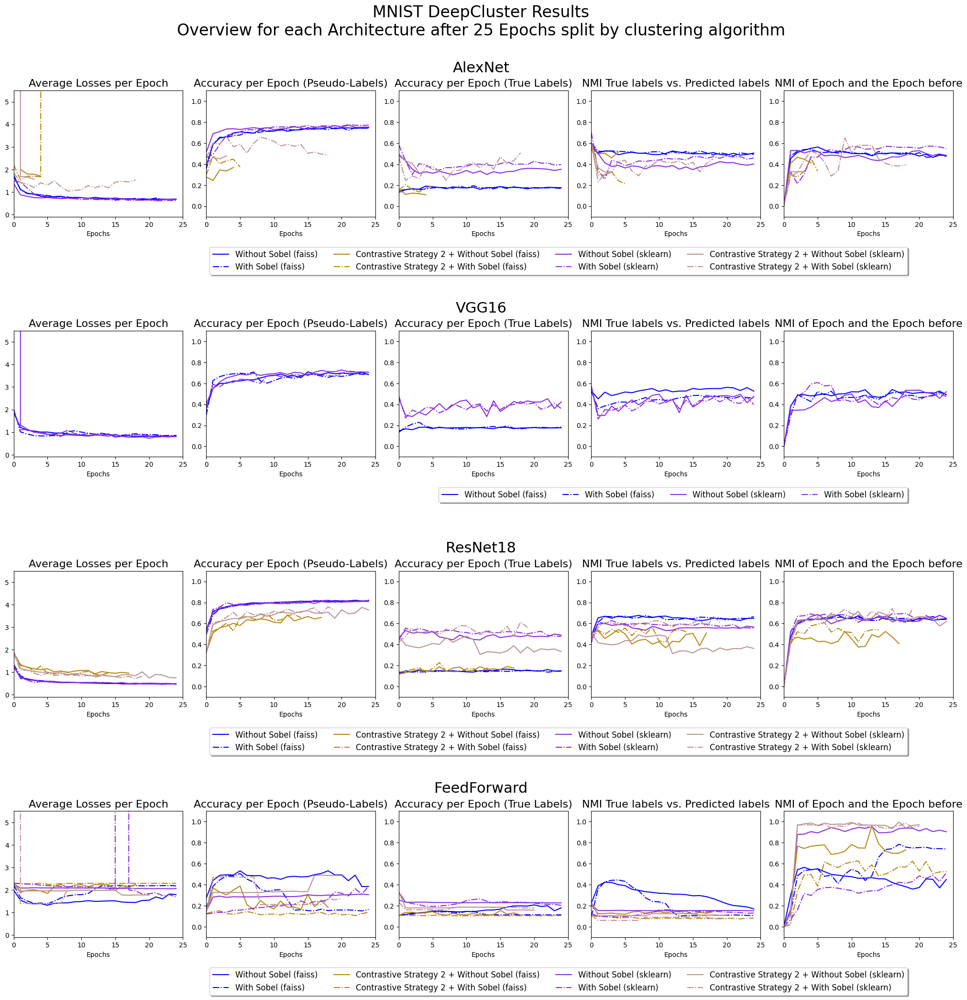

# MNIST

## All results together

## Base DeepCluster Algorithm

## Base DeepCluster + Scikit-Learn

## Base DeepCluster + Scikit-Learn + Adam Optimizer

## Base DeepCluster + Scikit-Learn + Adjusted k

## Base DeepCluster + Scikit-Learn + Contrastive Strategy 1

## Base DeepCluster + Scikit-Learn + Contrastive Strategy 2

