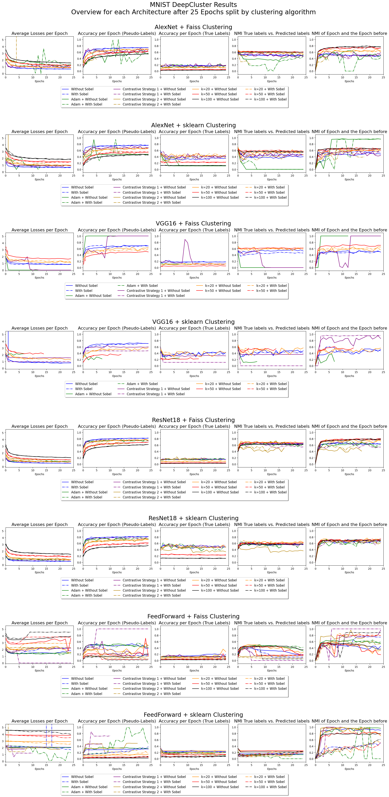

# MNIST





### Commands for easy repetition
#### AlexNet
**Without Sobel**:
```bash
for i in {1..5}; do python3 main.py --arch AlexNet --input_dim 1 --num_classes 10 --epochs 25 --requires_grad --dataset MNIST --ds_train --batch_size 128 --reassign_optimizer_tl --pca --pca_method faiss --pca_whitening --clustering faiss --metrics --metrics_dir ./metrics/MNIST/5_runs_100_epochs/ -v; python3 main.py --arch AlexNet --input_dim 1 --num_classes 10 --epochs 25 --requires_grad --dataset MNIST --ds_train --batch_size 128 --reassign_optimizer_tl --pca --pca_method sklearn --pca_whitening --clustering faiss --metrics --metrics_dir ./metrics/MNIST/5_runs_100_epochs/ -v; python3 main.py --arch AlexNet --input_dim 1 --num_classes 10 --epochs 25 --requires_grad --dataset MNIST --ds_train --batch_size 128 --reassign_optimizer_tl --pca --pca_method faiss --pca_whitening --clustering sklearn --metrics --metrics_dir ./metrics/MNIST/5_runs_100_epochs/ -v; python3 main.py --arch AlexNet --input_dim 1 --num_classes 10 --epochs 25 --requires_grad --dataset MNIST --ds_train --batch_size 128 --reassign_optimizer_tl --pca --pca_method sklearn --pca_whitening --clustering sklearn --metrics --metrics_dir ./metrics/MNIST/5_runs_100_epochs/ -v; done
```

**With Sobel**:
```bash
for i in {1..5}; do python3 main.py --arch AlexNet --input_dim 2 --sobel --num_classes 10 --epochs 25 --requires_grad --dataset MNIST --ds_train --batch_size 128 --reassign_optimizer_tl --pca --pca_method faiss --pca_whitening --clustering faiss --metrics --metrics_dir ./metrics/MNIST/5_runs_100_epochs/ -v; python3 main.py --arch AlexNet --input_dim 2 --sobel --num_classes 10 --epochs 25 --requires_grad --dataset MNIST --ds_train --batch_size 128 --reassign_optimizer_tl --pca --pca_method sklearn --pca_whitening --clustering faiss --metrics --metrics_dir ./metrics/MNIST/5_runs_100_epochs/ -v; python3 main.py --arch AlexNet --input_dim 2 --sobel --num_classes 10 --epochs 25 --requires_grad --dataset MNIST --ds_train --batch_size 128 --reassign_optimizer_tl --pca --pca_method faiss --pca_whitening --clustering sklearn --metrics --metrics_dir ./metrics/MNIST/5_runs_100_epochs/ -v; python3 main.py --arch AlexNet --input_dim 2 --sobel --num_classes 10 --epochs 25 --requires_grad --dataset MNIST --ds_train --batch_size 128 --reassign_optimizer_tl --pca --pca_method sklearn --pca_whitening --clustering sklearn --metrics --metrics_dir ./metrics/MNIST/5_runs_100_epochs/ -v; done
```

**Adjusted class size**
```bash
for i in 20 50 100; do python3 main.py --arch AlexNet --input_dim 1 --num_classes $i --epochs 25 --requires_grad --dataset MNIST --ds_train --batch_size 128 --reassign_optimizer_tl --pca --pca_method faiss --pca_whitening --clustering faiss --metrics --metrics_dir ./metrics/MNIST/5_runs_100_epochs/ -v --remove_head; python3 main.py --arch AlexNet --input_dim 1 --num_classes $i --epochs 25 --requires_grad --dataset MNIST --ds_train --batch_size 128 --reassign_optimizer_tl --pca --pca_method faiss --pca_whitening --clustering sklearn --metrics --metrics_dir ./metrics/MNIST/5_runs_100_epochs/ -v --remove_head; python3 main.py --arch AlexNet --input_dim 2 --num_classes $i --sobel --epochs 25 --requires_grad --dataset MNIST --ds_train --batch_size 128 --reassign_optimizer_tl --pca --pca_method faiss --pca_whitening --clustering faiss --metrics --metrics_dir ./metrics/MNIST/5_runs_100_epochs/ -v --remove_head; python3 main.py --arch AlexNet --input_dim 2 --num_classes $i --sobel --epochs 25 --requires_grad --dataset MNIST --ds_train --batch_size 128 --reassign_optimizer_tl --pca --pca_method faiss --pca_whitening --clustering sklearn --metrics --metrics_dir ./metrics/MNIST/5_runs_100_epochs/ -v --remove_head; done
```

---


#### VGG16
**Without Sobel**:
```bash
for i in {1..5}; do python3 main.py --arch VGG16 --input_dim 1 --num_classes 10 --epochs 25 --requires_grad --dataset MNIST --ds_train --batch_size 32 --reassign_optimizer_tl --pca --pca_method faiss --pca_whitening --clustering faiss --metrics --metrics_dir ./metrics/MNIST/5_runs_100_epochs/ -v; python3 main.py --arch VGG16 --input_dim 1 --num_classes 10 --epochs 25 --requires_grad --dataset MNIST --ds_train --batch_size 32 --reassign_optimizer_tl --pca --pca_method sklearn --pca_whitening --clustering faiss --metrics --metrics_dir ./metrics/MNIST/5_runs_100_epochs/ -v; python3 main.py --arch VGG16 --input_dim 1 --num_classes 10 --epochs 25 --requires_grad --dataset MNIST --ds_train --batch_size 32 --reassign_optimizer_tl --pca --pca_method faiss --pca_whitening --clustering sklearn --metrics --metrics_dir ./metrics/MNIST/5_runs_100_epochs/ -v; python3 main.py --arch VGG16 --input_dim 1 --num_classes 10 --epochs 25 --requires_grad --dataset MNIST --ds_train --batch_size 32 --reassign_optimizer_tl --pca --pca_method sklearn --pca_whitening --clustering sklearn --metrics --metrics_dir ./metrics/MNIST/5_runs_100_epochs/ -v; done
```

**With Sobel**:
```bash
for i in {1..5}; do python3 main.py --arch VGG16 --input_dim 2 --sobel --num_classes 10 --epochs 25 --requires_grad --dataset MNIST --ds_train --batch_size 32 --reassign_optimizer_tl --pca --pca_method faiss --pca_whitening --clustering faiss --metrics --metrics_dir ./metrics/MNIST/5_runs_100_epochs/ -v; python3 main.py --arch VGG16 --input_dim 2 --sobel --num_classes 10 --epochs 25 --requires_grad --dataset MNIST --ds_train --batch_size 32 --reassign_optimizer_tl --pca --pca_method sklearn --pca_whitening --clustering faiss --metrics --metrics_dir ./metrics/MNIST/5_runs_100_epochs/ -v; python3 main.py --arch VGG16 --input_dim 2 --sobel --num_classes 10 --epochs 25 --requires_grad --dataset MNIST --ds_train --batch_size 32 --reassign_optimizer_tl --pca --pca_method faiss --pca_whitening --clustering sklearn --metrics --metrics_dir ./metrics/MNIST/5_runs_100_epochs/ -v; python3 main.py --arch VGG16 --input_dim 2 --sobel --num_classes 10 --epochs 25 --requires_grad --dataset MNIST --ds_train --batch_size 32 --reassign_optimizer_tl --pca --pca_method sklearn --pca_whitening --clustering sklearn --metrics --metrics_dir ./metrics/MNIST/5_runs_100_epochs/ -v; done
```

**Adjusted class size**
```bash (cancalit)
for i in 20 50 100; do python3 main.py --arch VGG16 --input_dim 1 --num_classes $i --epochs 25 --requires_grad --dataset MNIST --ds_train --batch_size 32 --reassign_optimizer_tl --pca --pca_method faiss --pca_whitening --clustering faiss --metrics --metrics_dir ./metrics/MNIST/5_runs_100_epochs/ -v --remove_head; python3 main.py --arch VGG16 --input_dim 1 --num_classes $i --epochs 25 --requires_grad --dataset MNIST --ds_train --batch_size 32 --reassign_optimizer_tl --pca --pca_method faiss --pca_whitening --clustering sklearn --metrics --metrics_dir ./metrics/MNIST/5_runs_100_epochs/ -v --remove_head; python3 main.py --arch VGG16 --input_dim 2 --num_classes $i --sobel --epochs 25 --requires_grad --dataset MNIST --ds_train --batch_size 32 --reassign_optimizer_tl --pca --pca_method faiss --pca_whitening --clustering faiss --metrics --metrics_dir ./metrics/MNIST/5_runs_100_epochs/ -v --remove_head; python3 main.py --arch VGG16 --input_dim 2 --num_classes $i --sobel --epochs 25 --requires_grad --dataset MNIST --ds_train --batch_size 32 --reassign_optimizer_tl --pca --pca_method faiss --pca_whitening --clustering sklearn --metrics --metrics_dir ./metrics/MNIST/5_runs_100_epochs/ -v --remove_head; done
```

---


#### ResNet18
**Without Sobel**:
```bash
for i in {1..5}; do python3 main.py --arch ResNet18 --input_dim 1 --num_classes 10 --epochs 25 --requires_grad --dataset MNIST --ds_train --batch_size 128 --reassign_optimizer_tl --pca --pca_method faiss --pca_whitening --clustering faiss --metrics --metrics_dir ./metrics/MNIST/5_runs_100_epochs/ -v; python3 main.py --arch ResNet18 --input_dim 1 --num_classes 10 --epochs 25 --requires_grad --dataset MNIST --ds_train --batch_size 128 --reassign_optimizer_tl --pca --pca_method sklearn --pca_whitening --clustering faiss --metrics --metrics_dir ./metrics/MNIST/5_runs_100_epochs/ -v; python3 main.py --arch ResNet18 --input_dim 1 --num_classes 10 --epochs 25 --requires_grad --dataset MNIST --ds_train --batch_size 128 --reassign_optimizer_tl --pca --pca_method faiss --pca_whitening --clustering sklearn --metrics --metrics_dir ./metrics/MNIST/5_runs_100_epochs/ -v; python3 main.py --arch ResNet18 --input_dim 1 --num_classes 10 --epochs 25 --requires_grad --dataset MNIST --ds_train --batch_size 128 --reassign_optimizer_tl --pca --pca_method sklearn --pca_whitening --clustering sklearn --metrics --metrics_dir ./metrics/MNIST/5_runs_100_epochs/ -v; done
```

**With Sobel**:
```bash
for i in {1..5}; do python3 main.py --arch ResNet18 --input_dim 2 --sobel --num_classes 10 --epochs 25 --requires_grad --dataset MNIST --ds_train --batch_size 128 --reassign_optimizer_tl --pca --pca_method faiss --pca_whitening --clustering faiss --metrics --metrics_dir ./metrics/MNIST/5_runs_100_epochs/ -v; python3 main.py --arch ResNet18 --input_dim 2 --sobel --num_classes 10 --epochs 25 --requires_grad --dataset MNIST --ds_train --batch_size 128 --reassign_optimizer_tl --pca --pca_method sklearn --pca_whitening --clustering faiss --metrics --metrics_dir ./metrics/MNIST/5_runs_100_epochs/ -v; python3 main.py --arch ResNet18 --input_dim 2 --sobel --num_classes 10 --epochs 25 --requires_grad --dataset MNIST --ds_train --batch_size 128 --reassign_optimizer_tl --pca --pca_method faiss --pca_whitening --clustering sklearn --metrics --metrics_dir ./metrics/MNIST/5_runs_100_epochs/ -v; python3 main.py --arch ResNet18 --input_dim 2 --sobel --num_classes 10 --epochs 25 --requires_grad --dataset MNIST --ds_train --batch_size 128 --reassign_optimizer_tl --pca --pca_method sklearn --pca_whitening --clustering sklearn --metrics --metrics_dir ./metrics/MNIST/5_runs_100_epochs/ -v; done
```

**Adjusted class size**
```bash
for i in 20 50 100; do python3 main.py --arch ResNet18 --input_dim 1 --num_classes $i --epochs 25 --requires_grad --dataset MNIST --ds_train --batch_size 128 --reassign_optimizer_tl --pca --pca_method faiss --pca_whitening --clustering faiss --metrics --metrics_dir ./metrics/MNIST/5_runs_100_epochs/ -v --remove_head; python3 main.py --arch ResNet18 --input_dim 1 --num_classes $i --epochs 25 --requires_grad --dataset MNIST --ds_train --batch_size 128 --reassign_optimizer_tl --pca --pca_method faiss --pca_whitening --clustering sklearn --metrics --metrics_dir ./metrics/MNIST/5_runs_100_epochs/ -v --remove_head; python3 main.py --arch ResNet18 --input_dim 2 --num_classes $i --sobel --epochs 25 --requires_grad --dataset MNIST --ds_train --batch_size 128 --reassign_optimizer_tl --pca --pca_method faiss --pca_whitening --clustering faiss --metrics --metrics_dir ./metrics/MNIST/5_runs_100_epochs/ -v --remove_head; python3 main.py --arch ResNet18 --input_dim 2 --num_classes $i --sobel --epochs 25 --requires_grad --dataset MNIST --ds_train --batch_size 128 --reassign_optimizer_tl --pca --pca_method faiss --pca_whitening --clustering sklearn --metrics --metrics_dir ./metrics/MNIST/5_runs_100_epochs/ -v --remove_head; done
```

---

#### FeedForward (Without PCA due to lower Feature Space)
**Without Sobel**:
```bash
for i in {1..5}; do python3 main.py --arch FeedForward --input_dim 1 --num_classes 10 --epochs 25 --requires_grad --dataset MNIST --ds_train --batch_size 128 --reassign_optimizer_tl --clustering faiss --metrics --metrics_dir ./metrics/MNIST/5_runs_100_epochs/ -v; python3 main.py --arch FeedForward --input_dim 1 --num_classes 10 --epochs 25 --requires_grad --dataset MNIST --ds_train --batch_size 128 --reassign_optimizer_tl --clustering sklearn --metrics --metrics_dir ./metrics/MNIST/5_runs_100_epochs/ -v; done
```

**With Sobel**:
```bash
for i in {1..5}; do python3 main.py --arch FeedForward --input_dim 2 --sobel --num_classes 10 --epochs 25 --requires_grad --dataset MNIST --ds_train --batch_size 128 --reassign_optimizer_tl --clustering faiss --metrics --metrics_dir ./metrics/MNIST/5_runs_100_epochs/ -v; python3 main.py --arch FeedForward --input_dim 2 --sobel --num_classes 10 --epochs 25 --requires_grad --dataset MNIST --ds_train --batch_size 128 --reassign_optimizer_tl --clustering sklearn --metrics --metrics_dir ./metrics/MNIST/5_runs_100_epochs/ -v; done
```

**Adjusted class size**
```bash
for i in 20 50 100; do python3 main.py --arch FeedForward --input_dim 1 --num_classes $i --epochs 25 --requires_grad --dataset MNIST --ds_train --batch_size 128 --reassign_optimizer_tl --clustering faiss --metrics --metrics_dir ./metrics/MNIST/5_runs_100_epochs/ -v --remove_head; python3 main.py --arch FeedForward --input_dim 1 --num_classes $i --epochs 25 --requires_grad --dataset MNIST --ds_train --batch_size 128 --reassign_optimizer_tl --clustering sklearn --metrics --metrics_dir ./metrics/MNIST/5_runs_100_epochs/ -v --remove_head; python3 main.py --arch FeedForward --input_dim 2 --num_classes $i --sobel --epochs 25 --requires_grad --dataset MNIST --ds_train --batch_size 128 --reassign_optimizer_tl --clustering faiss --metrics --metrics_dir ./metrics/MNIST/5_runs_100_epochs/ -v --remove_head; python3 main.py --arch FeedForward --input_dim 2 --num_classes $i --sobel --epochs 25 --requires_grad --dataset MNIST --ds_train --batch_size 128 --reassign_optimizer_tl --clustering sklearn --metrics --metrics_dir ./metrics/MNIST/5_runs_100_epochs/ -v --remove_head; done
```

## Adam Optimizer
Part1
```bash
python3 main.py --arch AlexNet --input_dim 1 --num_classes 10 --epochs 25 --requires_grad --dataset MNIST --ds_train --batch_size 128 --reassign_optimizer_tl --pca --pca_method faiss --pca_whitening --clustering faiss --metrics --metrics_dir ./metrics/MNIST/5_runs_100_epochs/ -v --optimizer Adam --optimizer_tl Adam; python3 main.py --arch AlexNet --input_dim 1 --num_classes 10 --epochs 25 --requires_grad --dataset MNIST --ds_train --batch_size 128 --reassign_optimizer_tl --pca --pca_method sklearn --pca_whitening --clustering sklearn --metrics --metrics_dir ./metrics/MNIST/5_runs_100_epochs/ -v --optimizer Adam --optimizer_tl Adam; python3 main.py --arch AlexNet --input_dim 2 --sobel --num_classes 10 --epochs 25 --requires_grad --dataset MNIST --ds_train --batch_size 128 --reassign_optimizer_tl --pca --pca_method faiss --pca_whitening --clustering faiss --metrics --metrics_dir ./metrics/MNIST/5_runs_100_epochs/ -v --optimizer Adam --optimizer_tl Adam; python3 main.py --arch AlexNet --input_dim 2 --sobel --num_classes 10 --epochs 25 --requires_grad --dataset MNIST --ds_train --batch_size 128 --reassign_optimizer_tl --pca --pca_method sklearn --pca_whitening --clustering sklearn --metrics --metrics_dir ./metrics/MNIST/5_runs_100_epochs/ -v --optimizer Adam --optimizer_tl Adam; python3 main.py --arch VGG16 --input_dim 1 --num_classes 10 --epochs 25 --requires_grad --dataset MNIST --ds_train --batch_size 32 --reassign_optimizer_tl --pca --pca_method faiss --pca_whitening --clustering faiss --metrics --metrics_dir ./metrics/MNIST/5_runs_100_epochs/ -v --optimizer Adam --optimizer_tl Adam; python3 main.py --arch VGG16 --input_dim 1 --num_classes 10 --epochs 25 --requires_grad --dataset MNIST --ds_train --batch_size 32 --reassign_optimizer_tl --pca --pca_method sklearn --pca_whitening --clustering sklearn --metrics --metrics_dir ./metrics/MNIST/5_runs_100_epochs/ -v --optimizer Adam --optimizer_tl Adam; python3 main.py --arch ResNet18 --input_dim 1 --num_classes 10 --epochs 25 --requires_grad --dataset MNIST --ds_train --batch_size 128 --reassign_optimizer_tl --pca --pca_method faiss --pca_whitening --clustering faiss --metrics --metrics_dir ./metrics/MNIST/5_runs_100_epochs/ -v --optimizer Adam --optimizer_tl Adam; python3 main.py --arch ResNet18 --input_dim 1 --num_classes 10 --epochs 25 --requires_grad --dataset MNIST --ds_train --batch_size 128 --reassign_optimizer_tl --pca --pca_method sklearn --pca_whitening --clustering sklearn --metrics --metrics_dir ./metrics/MNIST/5_runs_100_epochs/ -v --optimizer Adam --optimizer_tl Adam;
```

```bash
python3 main.py --arch AlexNet --input_dim 1 --num_classes 10 --epochs 25 --requires_grad --dataset MNIST --ds_train --batch_size 128 --reassign_optimizer_tl --pca --pca_method faiss --pca_whitening --clustering faiss --metrics --metrics_dir ./metrics/MNIST/5_runs_100_epochs/ -v --optimizer Adam --optimizer_tl Adam --lr 0.001 --lr_tl 0.001 --weight_decay 0 --weight_decay_tl 0; python3 main.py --arch AlexNet --input_dim 1 --num_classes 10 --epochs 25 --requires_grad --dataset MNIST --ds_train --batch_size 128 --reassign_optimizer_tl --pca --pca_method sklearn --pca_whitening --clustering sklearn --metrics --metrics_dir ./metrics/MNIST/5_runs_100_epochs/ -v --optimizer Adam --optimizer_tl Adam --lr 0.001 --lr_tl 0.001 --weight_decay 0 --weight_decay_tl 0; python3 main.py --arch AlexNet --input_dim 2 --sobel --num_classes 10 --epochs 25 --requires_grad --dataset MNIST --ds_train --batch_size 128 --reassign_optimizer_tl --pca --pca_method faiss --pca_whitening --clustering faiss --metrics --metrics_dir ./metrics/MNIST/5_runs_100_epochs/ -v --optimizer Adam --optimizer_tl Adam --lr 0.001 --lr_tl 0.001 --weight_decay 0 --weight_decay_tl 0; python3 main.py --arch AlexNet --input_dim 2 --sobel --num_classes 10 --epochs 25 --requires_grad --dataset MNIST --ds_train --batch_size 128 --reassign_optimizer_tl --pca --pca_method sklearn --pca_whitening --clustering sklearn --metrics --metrics_dir ./metrics/MNIST/5_runs_100_epochs/ -v --optimizer Adam --optimizer_tl Adam --lr 0.001 --lr_tl 0.001 --weight_decay 0 --weight_decay_tl 0; python3 main.py --arch VGG16 --input_dim 1 --num_classes 10 --epochs 25 --requires_grad --dataset MNIST --ds_train --batch_size 32 --reassign_optimizer_tl --pca --pca_method faiss --pca_whitening --clustering faiss --metrics --metrics_dir ./metrics/MNIST/5_runs_100_epochs/ -v --optimizer Adam --optimizer_tl Adam --lr 0.001 --lr_tl 0.001 --weight_decay 0 --weight_decay_tl 0; python3 main.py --arch VGG16 --input_dim 1 --num_classes 10 --epochs 25 --requires_grad --dataset MNIST --ds_train --batch_size 32 --reassign_optimizer_tl --pca --pca_method sklearn --pca_whitening --clustering sklearn --metrics --metrics_dir ./metrics/MNIST/5_runs_100_epochs/ -v --optimizer Adam --optimizer_tl Adam --lr 0.001 --lr_tl 0.001 --weight_decay 0 --weight_decay_tl 0; 

(charnockit)
python3 main.py --arch ResNet18 --input_dim 1 --num_classes 10 --epochs 25 --requires_grad --dataset MNIST --ds_train --batch_size 128 --reassign_optimizer_tl --pca --pca_method faiss --pca_whitening --clustering faiss --metrics --metrics_dir ./metrics/MNIST/5_runs_100_epochs/ -v --optimizer Adam --optimizer_tl Adam --lr 0.001 --lr_tl 0.001 --weight_decay 0 --weight_decay_tl 0; python3 main.py --arch ResNet18 --input_dim 1 --num_classes 10 --epochs 25 --requires_grad --dataset MNIST --ds_train --batch_size 128 --reassign_optimizer_tl --pca --pca_method sklearn --pca_whitening --clustering sklearn --metrics --metrics_dir ./metrics/MNIST/5_runs_100_epochs/ -v --optimizer Adam --optimizer_tl Adam --lr 0.001 --lr_tl 0.001 --weight_decay 0 --weight_decay_tl 0;
```

Part 2
```bash
python3 main.py --arch ResNet18 --input_dim 2 --sobel --num_classes 10 --epochs 25 --requires_grad --dataset MNIST --ds_train --batch_size 128 --reassign_optimizer_tl --pca --pca_method faiss --pca_whitening --clustering faiss --metrics --metrics_dir ./metrics/MNIST/5_runs_100_epochs/ -v --optimizer Adam --optimizer_tl Adam; python3 main.py --arch ResNet18 --input_dim 2 --sobel --num_classes 10 --epochs 25 --requires_grad --dataset MNIST --ds_train --batch_size 128 --reassign_optimizer_tl --pca --pca_method sklearn --pca_whitening --clustering sklearn --metrics --metrics_dir ./metrics/MNIST/5_runs_100_epochs/ -v --optimizer Adam --optimizer_tl Adam; python3 main.py --arch FeedForward --input_dim 1 --num_classes 10 --epochs 25 --requires_grad --dataset MNIST --ds_train --batch_size 128 --reassign_optimizer_tl --clustering faiss --metrics --metrics_dir ./metrics/MNIST/5_runs_100_epochs/ -v --optimizer Adam --optimizer_tl Adam; python3 main.py --arch FeedForward --input_dim 1 --num_classes 10 --epochs 25 --requires_grad --dataset MNIST --ds_train --batch_size 128 --reassign_optimizer_tl --clustering sklearn --metrics --metrics_dir ./metrics/MNIST/5_runs_100_epochs/ -v --optimizer Adam --optimizer_tl Adam; python3 main.py --arch FeedForward --input_dim 2 --sobel --num_classes 10 --epochs 25 --requires_grad --dataset MNIST --ds_train --batch_size 128 --reassign_optimizer_tl --clustering faiss --metrics --metrics_dir ./metrics/MNIST/5_runs_100_epochs/ -v --optimizer Adam --optimizer_tl Adam; python3 main.py --arch FeedForward --input_dim 2 --sobel --num_classes 10 --epochs 25 --requires_grad --dataset MNIST --ds_train --batch_size 128 --reassign_optimizer_tl --clustering sklearn --metrics --metrics_dir ./metrics/MNIST/5_runs_100_epochs/ -v --optimizer Adam --optimizer_tl Adam; python3 main.py --arch VGG16 --input_dim 2 --sobel --num_classes 10 --epochs 25 --requires_grad --dataset MNIST --ds_train --batch_size 32 --reassign_optimizer_tl --pca --pca_method faiss --pca_whitening --clustering faiss --metrics --metrics_dir ./metrics/MNIST/5_runs_100_epochs/ -v --optimizer Adam --optimizer_tl Adam; python3 main.py --arch VGG16 --input_dim 2 --sobel --num_classes 10 --epochs 25 --requires_grad --dataset MNIST --ds_train --batch_size 32 --reassign_optimizer_tl --pca --pca_method sklearn --pca_whitening --clustering sklearn --metrics --metrics_dir ./metrics/MNIST/5_runs_100_epochs/ -v --optimizer Adam --optimizer_tl Adam;
```

```bash (aplit)
python3 main.py --arch ResNet18 --input_dim 2 --sobel --num_classes 10 --epochs 25 --requires_grad --dataset MNIST --ds_train --batch_size 128 --reassign_optimizer_tl --pca --pca_method faiss --pca_whitening --clustering faiss --metrics --metrics_dir ./metrics/MNIST/5_runs_100_epochs/ -v --optimizer Adam --optimizer_tl Adam --lr 0.001 --lr_tl 0.001 --weight_decay 0 --weight_decay_tl 0; python3 main.py --arch ResNet18 --input_dim 2 --sobel --num_classes 10 --epochs 25 --requires_grad --dataset MNIST --ds_train --batch_size 128 --reassign_optimizer_tl --pca --pca_method sklearn --pca_whitening --clustering sklearn --metrics --metrics_dir ./metrics/MNIST/5_runs_100_epochs/ -v --optimizer Adam --optimizer_tl Adam --lr 0.001 --lr_tl 0.001 --weight_decay 0 --weight_decay_tl 0; python3 main.py --arch FeedForward --input_dim 1 --num_classes 10 --epochs 25 --requires_grad --dataset MNIST --ds_train --batch_size 128 --reassign_optimizer_tl --clustering faiss --metrics --metrics_dir ./metrics/MNIST/5_runs_100_epochs/ -v --optimizer Adam --optimizer_tl Adam --lr 0.001 --lr_tl 0.001 --weight_decay 0 --weight_decay_tl 0; python3 main.py --arch FeedForward --input_dim 1 --num_classes 10 --epochs 25 --requires_grad --dataset MNIST --ds_train --batch_size 128 --reassign_optimizer_tl --clustering sklearn --metrics --metrics_dir ./metrics/MNIST/5_runs_100_epochs/ -v --optimizer Adam --optimizer_tl Adam --lr 0.001 --lr_tl 0.001 --weight_decay 0 --weight_decay_tl 0; python3 main.py --arch FeedForward --input_dim 2 --sobel --num_classes 10 --epochs 25 --requires_grad --dataset MNIST --ds_train --batch_size 128 --reassign_optimizer_tl --clustering faiss --metrics --metrics_dir ./metrics/MNIST/5_runs_100_epochs/ -v --optimizer Adam --optimizer_tl Adam --lr 0.001 --lr_tl 0.001 --weight_decay 0 --weight_decay_tl 0; python3 main.py --arch FeedForward --input_dim 2 --sobel --num_classes 10 --epochs 25 --requires_grad --dataset MNIST --ds_train --batch_size 128 --reassign_optimizer_tl --clustering sklearn --metrics --metrics_dir ./metrics/MNIST/5_runs_100_epochs/ -v --optimizer Adam --optimizer_tl Adam --lr 0.001 --lr_tl 0.001 --weight_decay 0 --weight_decay_tl 0; python3 main.py --arch VGG16 --input_dim 2 --sobel --num_classes 10 --epochs 25 --requires_grad --dataset MNIST --ds_train --batch_size 32 --reassign_optimizer_tl --pca --pca_method faiss --pca_whitening --clustering faiss --metrics --metrics_dir ./metrics/MNIST/5_runs_100_epochs/ -v --optimizer Adam --optimizer_tl Adam --lr 0.001 --lr_tl 0.001 --weight_decay 0 --weight_decay_tl 0; python3 main.py --arch VGG16 --input_dim 2 --sobel --num_classes 10 --epochs 25 --requires_grad --dataset MNIST --ds_train --batch_size 32 --reassign_optimizer_tl --pca --pca_method sklearn --pca_whitening --clustering sklearn --metrics --metrics_dir ./metrics/MNIST/5_runs_100_epochs/ -v --optimizer Adam --optimizer_tl Adam --lr 0.001 --lr_tl 0.001 --weight_decay 0 --weight_decay_tl 0;
```


## Contrastive Strategies

### Strategy 1
**Without Sobel**
```bash
python3 main.py --arch AlexNet --input_dim 1 --num_classes 10 --epochs 25 --requires_grad --dataset MNIST --ds_train --batch_size 128 --reassign_optimizer_tl --pca --pca_method faiss --pca_whitening --clustering faiss --metrics --metrics_dir ./metrics/MNIST/5_runs_100_epochs/ -v --contrastive_strategy_1; python3 main.py --arch AlexNet --input_dim 1 --num_classes 10 --epochs 25 --requires_grad --dataset MNIST --ds_train --batch_size 128 --reassign_optimizer_tl --pca --pca_method sklearn --pca_whitening --clustering sklearn --metrics --metrics_dir ./metrics/MNIST/5_runs_100_epochs/ -v --contrastive_strategy_1; python3 main.py --arch VGG16 --input_dim 1 --num_classes 10 --epochs 25 --requires_grad --dataset MNIST --ds_train --batch_size 32 --reassign_optimizer_tl --pca --pca_method faiss --pca_whitening --clustering faiss --metrics --metrics_dir ./metrics/MNIST/5_runs_100_epochs/ -v --contrastive_strategy_1; python3 main.py --arch VGG16 --input_dim 1 --num_classes 10 --epochs 25 --requires_grad --dataset MNIST --ds_train --batch_size 32 --reassign_optimizer_tl --pca --pca_method sklearn --pca_whitening --clustering sklearn --metrics --metrics_dir ./metrics/MNIST/5_runs_100_epochs/ -v --contrastive_strategy_1; python3 main.py --arch ResNet18 --input_dim 1 --num_classes 10 --epochs 25 --requires_grad --dataset MNIST --ds_train --batch_size 128 --reassign_optimizer_tl --pca --pca_method faiss --pca_whitening --clustering faiss --metrics --metrics_dir ./metrics/MNIST/5_runs_100_epochs/ -v --contrastive_strategy_1; python3 main.py --arch ResNet18 --input_dim 1 --num_classes 10 --epochs 25 --requires_grad --dataset MNIST --ds_train --batch_size 128 --reassign_optimizer_tl --pca --pca_method sklearn --pca_whitening --clustering sklearn --metrics --metrics_dir ./metrics/MNIST/5_runs_100_epochs/ -v --contrastive_strategy_1; python3 main.py --arch FeedForward --input_dim 1 --num_classes 10 --epochs 25 --requires_grad --dataset MNIST --ds_train --batch_size 128 --reassign_optimizer_tl --clustering faiss --metrics --metrics_dir ./metrics/MNIST/5_runs_100_epochs/ -v --contrastive_strategy_1; python3 main.py --arch FeedForward --input_dim 1 --num_classes 10 --epochs 25 --requires_grad --dataset MNIST --ds_train --batch_size 128 --reassign_optimizer_tl --clustering sklearn --metrics --metrics_dir ./metrics/MNIST/5_runs_100_epochs/ -v --contrastive_strategy_1;
```

**With Sobel**
```bash
python3 main.py --arch AlexNet --input_dim 2 --sobel --num_classes 10 --epochs 25 --requires_grad --dataset MNIST --ds_train --batch_size 128 --reassign_optimizer_tl --pca --pca_method faiss --pca_whitening --clustering faiss --metrics --metrics_dir ./metrics/MNIST/5_runs_100_epochs/ -v --contrastive_strategy_1; python3 main.py --arch AlexNet --input_dim 2 --sobel --num_classes 10 --epochs 25 --requires_grad --dataset MNIST --ds_train --batch_size 128 --reassign_optimizer_tl --pca --pca_method sklearn --pca_whitening --clustering sklearn --metrics --metrics_dir ./metrics/MNIST/5_runs_100_epochs/ -v --contrastive_strategy_1; python3 main.py --arch VGG16 --input_dim 2 --sobel --num_classes 10 --epochs 25 --requires_grad --dataset MNIST --ds_train --batch_size 32 --reassign_optimizer_tl --pca --pca_method faiss --pca_whitening --clustering faiss --metrics --metrics_dir ./metrics/MNIST/5_runs_100_epochs/ -v --contrastive_strategy_1; python3 main.py --arch VGG16 --input_dim 2 --sobel --num_classes 10 --epochs 25 --requires_grad --dataset MNIST --ds_train --batch_size 32 --reassign_optimizer_tl --pca --pca_method sklearn --pca_whitening --clustering sklearn --metrics --metrics_dir ./metrics/MNIST/5_runs_100_epochs/ -v --contrastive_strategy_1; python3 main.py --arch ResNet18 --input_dim 2 --sobel --num_classes 10 --epochs 25 --requires_grad --dataset MNIST --ds_train --batch_size 128 --reassign_optimizer_tl --pca --pca_method faiss --pca_whitening --clustering faiss --metrics --metrics_dir ./metrics/MNIST/5_runs_100_epochs/ -v --contrastive_strategy_1; python3 main.py --arch ResNet18 --input_dim 2 --sobel --num_classes 10 --epochs 25 --requires_grad --dataset MNIST --ds_train --batch_size 128 --reassign_optimizer_tl --pca --pca_method sklearn --pca_whitening --clustering sklearn --metrics --metrics_dir ./metrics/MNIST/5_runs_100_epochs/ -v --contrastive_strategy_1; python3 main.py --arch FeedForward --input_dim 2 --sobel --num_classes 10 --epochs 25 --requires_grad --dataset MNIST --ds_train --batch_size 128 --reassign_optimizer_tl --clustering faiss --metrics --metrics_dir ./metrics/MNIST/5_runs_100_epochs/ -v --contrastive_strategy_1; python3 main.py --arch FeedForward --input_dim 2 --sobel --num_classes 10 --epochs 25 --requires_grad --dataset MNIST --ds_train --batch_size 128 --reassign_optimizer_tl --clustering sklearn --metrics --metrics_dir ./metrics/MNIST/5_runs_100_epochs/ -v --contrastive_strategy_1;
```

### Strategy 2
- RandomRotation up to 30 degree

**Without Sobel**
```bash (chondrit)
python3 main.py --arch AlexNet --input_dim 1 --num_classes 10 --epochs 25 --requires_grad --dataset MNIST --ds_train --batch_size 128 --reassign_optimizer_tl --pca --pca_method faiss --pca_whitening --clustering faiss --metrics --metrics_dir ./metrics/MNIST/5_runs_100_epochs/ -v --contrastive_strategy_2 --contrastive_strategy_2 --augmentation_resize 256 --augmentation_random_crop 224 --augmentation_random_rotation 30; python3 main.py --arch AlexNet --input_dim 1 --num_classes 10 --epochs 25 --requires_grad --dataset MNIST --ds_train --batch_size 128 --reassign_optimizer_tl --pca --pca_method sklearn --pca_whitening --clustering sklearn --metrics --metrics_dir ./metrics/MNIST/5_runs_100_epochs/ -v --contrastive_strategy_2 --contrastive_strategy_2 --augmentation_resize 256 --augmentation_random_crop 224 --augmentation_random_rotation 30; 

python3 main.py --arch VGG16 --input_dim 1 --num_classes 10 --epochs 25 --requires_grad --dataset MNIST --ds_train --batch_size 32 --reassign_optimizer_tl --pca --pca_method faiss --pca_whitening --clustering faiss --metrics --metrics_dir ./metrics/MNIST/5_runs_100_epochs/ -v --contrastive_strategy_2 --contrastive_strategy_2 --augmentation_resize 256 --augmentation_random_crop 224 --augmentation_random_rotation 30; python3 main.py --arch VGG16 --input_dim 1 --num_classes 10 --epochs 25 --requires_grad --dataset MNIST --ds_train --batch_size 32 --reassign_optimizer_tl --pca --pca_method sklearn --pca_whitening --clustering sklearn --metrics --metrics_dir ./metrics/MNIST/5_runs_100_epochs/ -v --contrastive_strategy_2 --contrastive_strategy_2 --augmentation_resize 256 --augmentation_random_crop 224 --augmentation_random_rotation 30; 

(chondrit)
python3 main.py --arch ResNet18 --input_dim 1 --num_classes 10 --epochs 25 --requires_grad --dataset MNIST --ds_train --batch_size 128 --reassign_optimizer_tl --pca --pca_method faiss --pca_whitening --clustering faiss --metrics --metrics_dir ./metrics/MNIST/5_runs_100_epochs/ -v --contrastive_strategy_2 --contrastive_strategy_2 --augmentation_resize 256 --augmentation_random_crop 224 --augmentation_random_rotation 30; python3 main.py --arch ResNet18 --input_dim 1 --num_classes 10 --epochs 25 --requires_grad --dataset MNIST --ds_train --batch_size 128 --reassign_optimizer_tl --pca --pca_method sklearn --pca_whitening --clustering sklearn --metrics --metrics_dir ./metrics/MNIST/5_runs_100_epochs/ -v --contrastive_strategy_2 --contrastive_strategy_2 --augmentation_resize 256 --augmentation_random_crop 224 --augmentation_random_rotation 30; 

(enderbit)
python3 main.py --arch FeedForward --input_dim 1 --num_classes 10 --epochs 25 --requires_grad --dataset MNIST --ds_train --batch_size 128 --reassign_optimizer_tl --clustering faiss --metrics --metrics_dir ./metrics/MNIST/5_runs_100_epochs/ -v --contrastive_strategy_2 --contrastive_strategy_2 --augmentation_resize 256 --augmentation_random_crop 224 --augmentation_random_rotation 30; python3 main.py --arch FeedForward --input_dim 1 --num_classes 10 --epochs 25 --requires_grad --dataset MNIST --ds_train --batch_size 128 --reassign_optimizer_tl --clustering sklearn --metrics --metrics_dir ./metrics/MNIST/5_runs_100_epochs/ -v --contrastive_strategy_2 --contrastive_strategy_2 --augmentation_resize 256 --augmentation_random_crop 224 --augmentation_random_rotation 30;
```

**With Sobel**
```bash (chert)
python3 main.py --arch AlexNet --input_dim 2 --sobel --num_classes 10 --epochs 25 --requires_grad --dataset MNIST --ds_train --batch_size 128 --reassign_optimizer_tl --pca --pca_method faiss --pca_whitening --clustering faiss --metrics --metrics_dir ./metrics/MNIST/5_runs_100_epochs/ -v --contrastive_strategy_2 --contrastive_strategy_2 --augmentation_resize 256 --augmentation_random_crop 224 --augmentation_random_rotation 30; python3 main.py --arch AlexNet --input_dim 2 --sobel --num_classes 10 --epochs 25 --requires_grad --dataset MNIST --ds_train --batch_size 128 --reassign_optimizer_tl --pca --pca_method sklearn --pca_whitening --clustering sklearn --metrics --metrics_dir ./metrics/MNIST/5_runs_100_epochs/ -v --contrastive_strategy_2 --contrastive_strategy_2 --augmentation_resize 256 --augmentation_random_crop 224 --augmentation_random_rotation 30; 


python3 main.py --arch VGG16 --input_dim 2 --sobel --num_classes 10 --epochs 25 --requires_grad --dataset MNIST --ds_train --batch_size 32 --reassign_optimizer_tl --pca --pca_method faiss --pca_whitening --clustering faiss --metrics --metrics_dir ./metrics/MNIST/5_runs_100_epochs/ -v --contrastive_strategy_2 --contrastive_strategy_2 --augmentation_resize 256 --augmentation_random_crop 224 --augmentation_random_rotation 30; python3 main.py --arch VGG16 --input_dim 2 --sobel --num_classes 10 --epochs 25 --requires_grad --dataset MNIST --ds_train --batch_size 32 --reassign_optimizer_tl --pca --pca_method sklearn --pca_whitening --clustering sklearn --metrics --metrics_dir ./metrics/MNIST/5_runs_100_epochs/ -v --contrastive_strategy_2 --contrastive_strategy_2 --augmentation_resize 256 --augmentation_random_crop 224 --augmentation_random_rotation 30; 

(chert)
python3 main.py --arch ResNet18 --input_dim 2 --sobel --num_classes 10 --epochs 25 --requires_grad --dataset MNIST --ds_train --batch_size 128 --reassign_optimizer_tl --pca --pca_method faiss --pca_whitening --clustering faiss --metrics --metrics_dir ./metrics/MNIST/5_runs_100_epochs/ -v --contrastive_strategy_2 --contrastive_strategy_2 --augmentation_resize 256 --augmentation_random_crop 224 --augmentation_random_rotation 30; python3 main.py --arch ResNet18 --input_dim 2 --sobel --num_classes 10 --epochs 25 --requires_grad --dataset MNIST --ds_train --batch_size 128 --reassign_optimizer_tl --pca --pca_method sklearn --pca_whitening --clustering sklearn --metrics --metrics_dir ./metrics/MNIST/5_runs_100_epochs/ -v --contrastive_strategy_2 --contrastive_strategy_2 --augmentation_resize 256 --augmentation_random_crop 224 --augmentation_random_rotation 30; 

(arenit)
python3 main.py --arch FeedForward --input_dim 2 --sobel --num_classes 10 --epochs 25 --requires_grad --dataset MNIST --ds_train --batch_size 128 --reassign_optimizer_tl --clustering faiss --metrics --metrics_dir ./metrics/MNIST/5_runs_100_epochs/ -v --contrastive_strategy_2 --contrastive_strategy_2 --augmentation_resize 256 --augmentation_random_crop 224 --augmentation_random_rotation 30; python3 main.py --arch FeedForward --input_dim 2 --sobel --num_classes 10 --epochs 25 --requires_grad --dataset MNIST --ds_train --batch_size 128 --reassign_optimizer_tl --clustering sklearn --metrics --metrics_dir ./metrics/MNIST/5_runs_100_epochs/ -v --contrastive_strategy_2 --contrastive_strategy_2 --augmentation_resize 256 --augmentation_random_crop 224 --augmentation_random_rotation 30;
```